# FHIR & HL7 Ready Multi-Tenant Hospital Management System Database Architecture and Module Blueprint

## Cover Page

**Project Name:** Plasmit Global Hospital Management System  
**Document Name:** FHIR & HL7 Ready Database Architecture Blueprint  
**Version:** 1.0  
**Prepared For:** Product, Engineering, Architecture, and Leadership Teams  
**Prepared By:** Plasmit Engineering Team  
**Document Type:** Board-Level and Technical-Level Architecture Blueprint  
**Target Audience:** Board of Directors, CTO, Solution Architects, Backend Developers, Database Developers, Frontend Developers, Healthcare Compliance Team, Integration Team

---

## Table of Contents

1. Executive Summary  
2. Key Design Goals  
3. Multi-Tenant Hospital Scenarios  
4. Database Architecture Options  
5. Recommended Data Hierarchy  
6. FHIR Resource Mapping Overview  
7. HL7 Integration Strategy  
8. FHIR Integration Layer Design  
9. Security and Data Isolation  
10. Normalization Strategy  
11. Denormalization Strategy  
12. Core Database Foundation Tables  
13. Complete Hospital Module Coverage  
14. Module to FHIR Mapping Table  
15. Patient Journey Command Center View  
16. Branch-Level Data Access Scenarios  
17. API and Microservices Alignment  
18. Reporting and Analytics  
19. Compliance and Audit  
20. Recommended Indexing Strategy  
21. Backup and Disaster Recovery Strategy  
22. Implementation Roadmap  
23. Final Recommendation  
24. Appendix  
25. Final Deliverable Summary

---

## 1. Executive Summary

Healthcare SaaS platforms require a database architecture that is scalable, secure, interoperable, auditable, and operationally practical. A hospital management system must support multiple hospitals, multiple branches, department-specific workflows, patient-level clinical records, financial transactions, diagnostic integrations, pharmacy operations, and regulatory audit requirements.

The recommended architecture for Plasmit Global Hospital Management System is a **hybrid multi-tenant SaaS database architecture**:

> **Default SaaS model:** Shared database + shared tables using `tenant_id`, `hospital_id`, and `branch_id` isolation.  
> **Enterprise model:** Optional dedicated schema or dedicated database for large enterprise, government, or country-level deployments.

This design supports:

- Strong hospital-wise and branch-wise data isolation.
- Fast product rollout and centralized upgrades.
- HL7 v2 integration for legacy systems, LIS, RIS, machines, and analyzers.
- FHIR API readiness for modern interoperability using REST/JSON resource exchange.
- Normalized transactional data for correctness and auditability.
- Denormalized reporting layers for dashboards, command centers, AI, and analytics.
- Enterprise-grade audit logging, access control, backup, and disaster recovery.

FHIR should be implemented as an **interoperability and mapping layer**, not blindly copied as the only database structure. The internal HMS database should remain optimized for real hospital operations, while FHIR resources are generated, validated, stored, and exposed through a FHIR gateway.

HL7 v2 should be supported through an integration engine-style architecture with listener, parser, validator, message log, normalized table mapping, and outbound message generation.

---

## 2. Key Design Goals

| Goal | Description |
| --- | --- |
| Global scalability | Support small clinics, single hospitals, large hospital chains, and government deployments. |
| Multi-tenant SaaS readiness | Enable many unrelated hospitals to use one SaaS platform safely. |
| Hospital-wise isolation | Hospital data must never leak across customers. |
| Branch-wise isolation | Users should access only authorized branches unless cross-branch permission exists. |
| HL7/FHIR interoperability | Support legacy HL7 v2 and modern FHIR REST/JSON integrations. |
| Clean normalization | Core transactional data should be normalized for integrity and consistency. |
| Fast reporting | Use denormalized summaries for dashboards and analytics. |
| Auditability | Every clinical, financial, integration, and access event should be traceable. |
| Security | Enforce tenant, hospital, branch, role, and permission checks in backend and database queries. |
| Regulatory readiness | Support consent, audit, data masking, record access logs, and retention policies. |
| Future AI readiness | Create a clean data foundation for patient journey, risk scoring, command center, and analytics. |

---

## 3. Multi-Tenant Hospital Scenarios

Hospital SaaS must support many deployment patterns. The platform should not be designed only for a single hospital. It should handle a global SaaS market, enterprise clients, hospital chains, and government installations.

| Scenario | Example | Recommended Database Approach | Pros | Cons | When to Use |
| --- | --- | --- | --- | --- | --- |
| A. Single hospital with single branch | One standalone clinic | Shared DB + shared tables | Low cost, easy setup | Less physical isolation | Default SaaS onboarding |
| B. Single hospital with multiple branches | City hospital with 5 branches | Shared DB + shared tables with branch isolation | Central management, branch dashboards | Requires strict branch filters | Most hospital groups |
| C. Hospital group with multiple hospitals | Corporate group with many hospitals | Shared DB + shared tables with tenant/hospital/branch hierarchy | Group-level reporting | Query discipline required | Corporate healthcare groups |
| D. Many unrelated SaaS hospitals | Cloud SaaS platform | Shared DB + shared tables | Best upgrade and maintenance model | Highest need for tenant isolation discipline | Default product model |
| E. Enterprise hospital requiring separate schema | Large enterprise hospital | Shared DB server + separate schema | Better isolation, schema-level backup | Migration overhead | Enterprise contract |
| F. Enterprise hospital requiring separate database | Premium client | Dedicated database | Maximum logical isolation | Higher cost and ops complexity | Regulated enterprise |
| G. Government/large chain dedicated deployment | National hospital program | Dedicated deployment/database cluster | Strongest compliance boundary | Expensive | Government/country deployments |
| H. Patient visits multiple branches of same hospital | Same UHID across branches | Shared patient master + branch encounter rows | Unified patient history | Requires branch-level privacy rules | Multi-branch hospitals |
| I. Patient visits multiple hospitals under same tenant | Group-wide patient identity | Tenant-level MPI with hospital encounters | Unified group care journey | Complex consent rules | Hospital chains |
| J. Platform super admin support | SaaS support team | Metadata access only, clinical access denied by default | Support without PHI exposure | Needs break-glass workflow | SaaS operations |

---

## 4. Database Architecture Options

### Option 1: Shared Database + Shared Tables

All hospitals use the same database tables. Every transaction row includes:

```sql
tenant_id
hospital_id
branch_id
```

**Pros**

- Best for SaaS.
- Easy deployment.
- Easy maintenance.
- Easy upgrades.
- Lower cost.
- Easy platform-wide analytics.

**Cons**

- Every query must enforce tenant/hospital/branch filter.
- Mistake in query may create data leakage risk.

**Recommended for:** Default SaaS model.

### Option 2: Shared Database + Separate Schema Per Hospital

One database server contains different schemas for different hospitals.

**Pros**

- Better isolation.
- Hospital-wise backup/restore.
- Enterprise-friendly.

**Cons**

- Migration complexity.
- Multi-hospital analytics difficult.
- Schema management overhead.

**Recommended for:** Large enterprise hospitals.

### Option 3: Separate Database Per Hospital

Each hospital gets its own database.

**Pros**

- Maximum isolation.
- Best compliance separation.
- Easy dedicated backup.

**Cons**

- Expensive.
- Complex deployment.
- Hard upgrades.
- Hard analytics.

**Recommended for:** Government, large chains, country-level deployments.

### Final Recommended Architecture

> Use **Hybrid Multi-Tenant Architecture**:
>
> - Default: shared database + shared tables.
> - Enterprise: optional dedicated schema/database.
> - Always enforce `tenant_id`, `hospital_id`, `branch_id` from backend context, not frontend input.

---

## 5. Recommended Data Hierarchy

The platform should follow a consistent hierarchy:

```txt
Tenant / Organization Group
→ Hospital
→ Branch / Facility / Location
→ Department
→ Unit / Ward / Room / Bed
→ User / Doctor / Staff
→ Patient
→ Encounter / Visit
→ Clinical / Lab / Pharmacy / Billing / Documents
```

### Mermaid Diagram: Tenant to Clinical Data Hierarchy

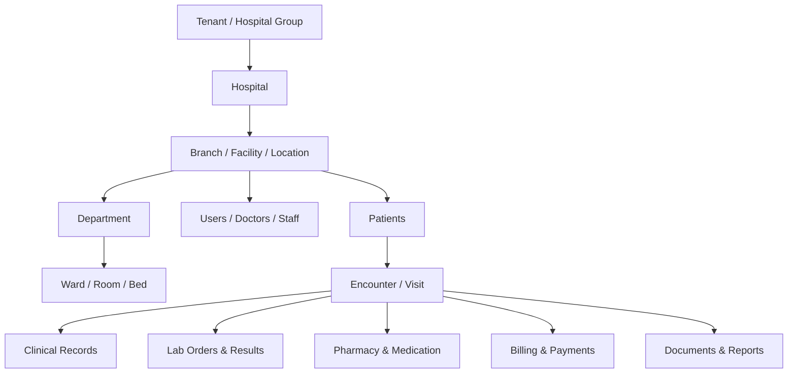

### Overall SaaS Architecture

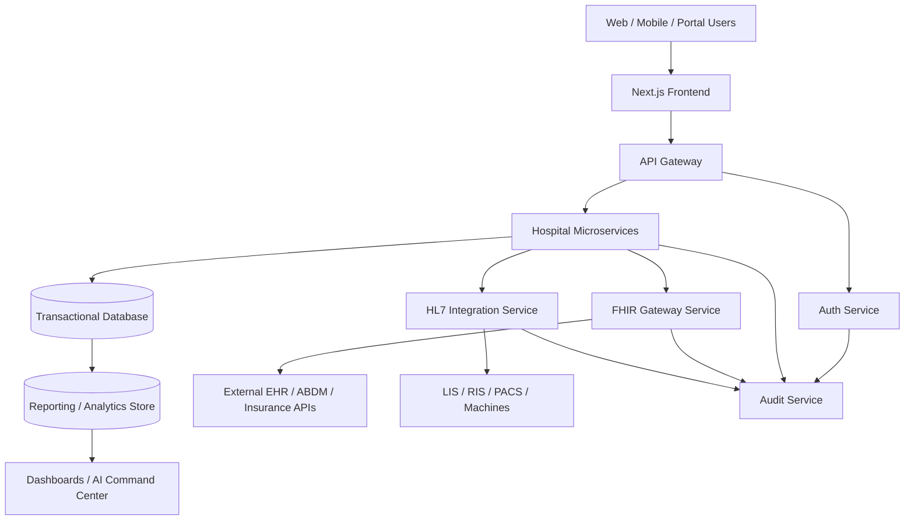

---

## 6. FHIR Resource Mapping Overview

FHIR should not be blindly copied as database tables. The internal database should remain normalized and operationally efficient. A FHIR mapping layer should translate internal HMS data into FHIR resources.

| HMS Concept | Internal Table Example | FHIR Resource | Purpose |
| --- | --- | --- | --- |
| Tenant/Hospital | `organizations`, `hospitals` | Organization | Legal/provider organization |
| Branch/Facility | `branches`, `locations` | Location | Branch, ward, room, bed |
| Department/Service | `departments`, `healthcare_services` | HealthcareService | Clinical service offering |
| Doctor/Clinician | `doctors`, `users` | Practitioner | Clinician identity |
| Doctor role in branch/department | `practitioner_roles` | PractitionerRole | Role/specialty/location relationship |
| Patient | `patients` | Patient | Person receiving care |
| Appointment | `appointments` | Appointment | Scheduled care event |
| Visit/Admission/Emergency | `encounters` | Encounter | Actual care context |
| Vitals/Lab values | `vitals`, `lab_results` | Observation | Measurements and results |
| Diagnosis | `diagnoses` | Condition | Problem/diagnosis |
| Procedure/Surgery | `procedures`, `surgeries` | Procedure | Performed clinical procedure |
| Prescription | `prescriptions` | MedicationRequest | Medication order |
| Medicine master | `medicines` | Medication | Medication definition |
| Lab/Radiology Order | `lab_orders`, `radiology_orders` | ServiceRequest | Diagnostic/procedure order |
| Diagnostic Report | `diagnostic_reports` | DiagnosticReport | Report grouping |
| Clinical Document | `documents` | DocumentReference | PDFs, reports, uploads |
| Allergy | `patient_allergies` | AllergyIntolerance | Allergy/intolerance |
| Immunization | `immunizations` | Immunization | Vaccination |
| Care Plan | `care_plans` | CarePlan | Planned care |
| Billing Account | `patient_accounts` | Account | Billing account |
| Charge | `billing_invoice_items` | ChargeItem | Charge line |
| Claim/Insurance | `insurance_claims` | Claim | Insurance claim |
| Payment Explanation | `claim_responses`, `payment_allocations` | ExplanationOfBenefit | Payment/claim explanation |
| Audit | `audit_logs` | AuditEvent | Audit trail |

**Important FHIR Concepts**

- Patient is the core person receiving care.
- Encounter connects OPD, IPD, emergency, virtual, and day-care visits.
- Observation is used for vitals, measurements, lab values, and clinical observations.
- DocumentReference is used for reports, notes, scans, PDFs, and uploaded documents.
- MedicationRequest represents medication orders and prescriptions.
- ServiceRequest represents lab, radiology, procedure, and diagnostic orders.

---

## 7. HL7 Integration Strategy

HL7 v2 remains common in older hospital systems, LIS, RIS, PACS, lab analyzers, billing systems, and medical devices. FHIR is modern API-based interoperability using REST/JSON/XML.

The platform should support both:

| Standard | Best Use |
| --- | --- |
| HL7 v2 | Legacy HIS/LIS/RIS, machines, analyzers, ADT/order/result messages |
| FHIR | Modern APIs, partner integrations, mobile apps, EHR exchange, ABDM-style APIs |

### Common HL7 v2 Message Types

| Message Type | Meaning | Typical Use |
| --- | --- | --- |
| ADT | Admission, Discharge, Transfer | Patient movement and registration |
| ORM | Order Message | Lab/radiology/procedure order |
| ORU | Observation Result | Lab/radiology result |
| SIU | Scheduling Information | Appointment/schedule message |
| DFT | Detailed Financial Transaction | Billing/charge posting |
| MDM | Medical Document Management | Clinical document/message |

### Mermaid Diagram: HL7 Inbound/Outbound Flow

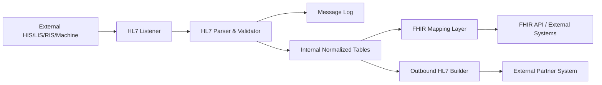

---

## 8. FHIR Integration Layer Design

FHIR support should be handled through a dedicated gateway/mapping service. It should build, validate, store, expose, and synchronize FHIR resources.

### Recommended FHIR Support Tables

| Table | Purpose | Key Columns | Example Use Case |
| --- | --- | --- | --- |
| `fhir_resource_mapping` | Maps internal records to FHIR resources | `internal_table`, `internal_id`, `resource_type`, `fhir_id` | Link `patients.id` to `Patient/{id}` |
| `fhir_resource_store` | Stores generated FHIR JSON | `resource_type`, `fhir_id`, `version`, `resource_json` | Cache full FHIR payload |
| `fhir_api_audit_log` | Logs FHIR API calls | `endpoint`, `method`, `status`, `user_id`, `payload_hash` | Trace external access |
| `fhir_sync_status` | Tracks sync with external systems | `resource_type`, `resource_id`, `sync_status`, `last_sync_at` | Retry failed pushes |
| `fhir_profile_registry` | Stores supported profiles | `profile_url`, `version`, `resource_type` | Validate against national profile |
| `fhir_code_system_mapping` | Maps internal codes to standard codes | `internal_code`, `system_url`, `standard_code` | Map internal lab code to LOINC |
| `fhir_value_set_mapping` | Maps dropdown/value sets | `value_set_url`, `internal_value`, `standard_value` | Map gender/status/priority |

### Mermaid Diagram: FHIR Integration Layer

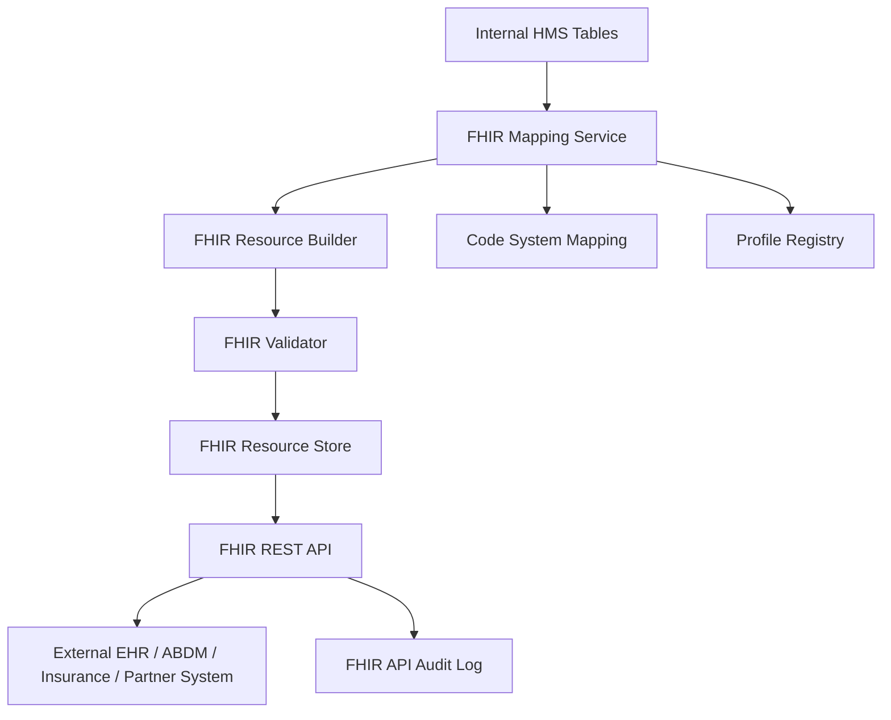

---

## 9. Security and Data Isolation

A hospital must never see another hospital’s data. A branch user must not see another branch’s data unless permission is granted. The frontend branch selector is not trusted. Backend must enforce tenant/hospital/branch from JWT/token.

### Sample JWT

```json
{
  "userId": 101,
  "tenantId": 1,
  "hospitalId": 10,
  "allowedBranchIds": [100, 101],
  "activeBranchId": 100,
  "role": "HOSPITAL_ADMIN"
}
```

### Mandatory Query Pattern

```sql
WHERE tenant_id = :tenantId
AND hospital_id = :hospitalId
AND branch_id IN (:allowedBranchIds)
AND is_deleted = 0
```

### Security Flow Using JWT

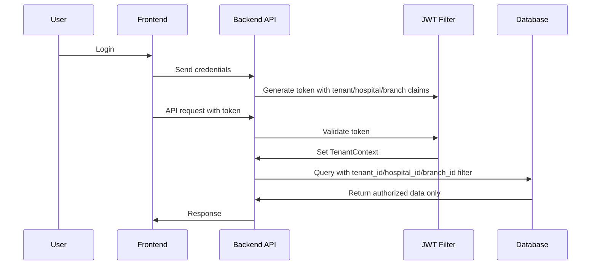

### Data Isolation Model

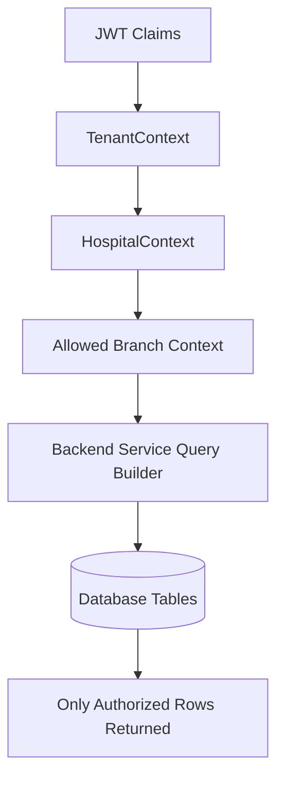

---

## 10. Normalization Strategy

Use normalized schema for core transactional modules.

Normalize:

- Patient demographics.
- Addresses.
- Identifiers.
- Encounters.
- Diagnoses.
- Prescriptions and prescription items.
- Lab orders and lab results.
- Billing invoices and invoice items.
- Payments and refunds.
- Pharmacy sales and stock movement.
- Ward/bed allocation.
- Audit logs.

### Benefits

- Less duplication.
- Better data integrity.
- Easier updates.
- Easier audit.
- Clear FHIR mapping.
- Better transactional consistency.

### Example Normalized Structure

```txt
patients
patient_identifiers
patient_addresses
encounters
encounter_diagnoses
vitals
prescriptions
prescription_items
lab_orders
lab_order_items
lab_results
```

### Encounter-Centric Clinical Data Model

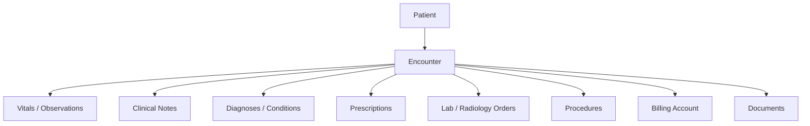

---

## 11. Denormalization Strategy

Use denormalized tables for dashboards, reporting, analytics, and AI summaries. Heavy reports should not run directly from transactional tables during business hours.

### Denormalized Examples

- `daily_branch_revenue_summary`
- `daily_patient_visit_summary`
- `department_wise_collection_summary`
- `doctor_performance_summary`
- `pharmacy_stock_snapshot`
- `lab_test_volume_summary`
- `bed_occupancy_summary`
- `insurance_claim_summary`
- `patient_journey_summary`

### Normalized to Denormalized Flow

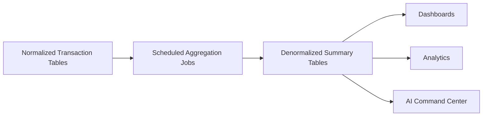

---

## 12. Core Database Foundation Tables

| Table | Purpose | Key Columns | Tenant Isolation Columns | FHIR Mapping |
| --- | --- | --- | --- | --- |
| `tenants` | SaaS customer/group | `id`, `name`, `status`, `plan_id` | `tenant_id` root | Organization |
| `hospitals` | Hospital entity | `id`, `tenant_id`, `name`, `license_no` | `tenant_id`, `hospital_id` | Organization |
| `branches` | Facility/branch | `id`, `hospital_id`, `name`, `address` | `tenant_id`, `hospital_id`, `branch_id` | Location |
| `departments` | Clinical/admin departments | `id`, `branch_id`, `name`, `type` | All three | HealthcareService |
| `healthcare_services` | Service catalog | `id`, `department_id`, `name`, `code` | All three | HealthcareService |
| `users` | Login users | `id`, `tenant_id`, `username`, `role_id` | `tenant_id` | Practitioner if clinical |
| `roles` | Role master | `id`, `name`, `scope` | `tenant_id` optional | N/A |
| `permissions` | Permission master | `id`, `code`, `module` | Global/tenant | N/A |
| `user_branch_access` | Branch permission | `user_id`, `branch_id`, `access_level` | All three | N/A |
| `patients` | Patient master | `id`, `tenant_id`, `hospital_id`, `mrn`, `name` | Tenant/hospital | Patient |
| `patient_identifiers` | MRN, ABHA, national ID | `patient_id`, `system`, `value` | Tenant/hospital | Patient.identifier |
| `patient_addresses` | Address book | `patient_id`, `type`, `address` | Tenant/hospital | Patient.address |
| `appointments` | Scheduled care | `patient_id`, `doctor_id`, `appointment_time` | All three | Appointment |
| `encounters` | Actual visit/admission | `patient_id`, `branch_id`, `class`, `status` | All three | Encounter |
| `vitals` | Vital signs | `encounter_id`, `code`, `value`, `unit` | All three | Observation |
| `diagnoses` | Diagnosis/problem | `encounter_id`, `code`, `description` | All three | Condition |
| `clinical_notes` | Notes/EMR | `encounter_id`, `note_type`, `content` | All three | DocumentReference/Composition |
| `prescriptions` | Prescription header | `encounter_id`, `doctor_id`, `status` | All three | MedicationRequest |
| `prescription_items` | Medicines ordered | `prescription_id`, `medicine_id`, `dose` | All three | MedicationRequest.dosageInstruction |
| `lab_orders` | Lab order header | `encounter_id`, `status`, `priority` | All three | ServiceRequest |
| `lab_order_items` | Ordered tests | `lab_order_id`, `test_id`, `status` | All three | ServiceRequest |
| `lab_results` | Test results | `lab_order_item_id`, `value`, `unit` | All three | Observation |
| `radiology_orders` | Imaging orders | `encounter_id`, `modality`, `status` | All three | ServiceRequest |
| `radiology_reports` | Imaging reports | `radiology_order_id`, `report_text` | All three | DiagnosticReport |
| `medicines` | Medicine master | `id`, `name`, `generic`, `form` | Tenant/hospital | Medication |
| `medicine_batches` | Batch/expiry | `medicine_id`, `batch_no`, `expiry_date` | Tenant/hospital/branch | Medication |
| `pharmacy_stock` | Branch stock | `medicine_id`, `branch_id`, `qty` | All three | Medication/Inventory extension |
| `pharmacy_sales` | Sale/dispense header | `patient_id`, `invoice_id`, `status` | All three | MedicationDispense |
| `pharmacy_sale_items` | Sale items | `sale_id`, `medicine_id`, `qty` | All three | MedicationDispense |
| `billing_invoices` | Invoice header | `patient_id`, `encounter_id`, `total` | All three | Account/Claim |
| `billing_invoice_items` | Invoice items | `invoice_id`, `service_code`, `amount` | All three | ChargeItem |
| `payments` | Payment records | `invoice_id`, `amount`, `method` | All three | ExplanationOfBenefit |
| `refunds` | Refund records | `payment_id`, `amount`, `reason` | All three | ExplanationOfBenefit |
| `insurance_claims` | Claim tracking | `patient_id`, `payer_id`, `status` | All three | Claim |
| `documents` | Reports/files | `patient_id`, `file_url`, `type` | All three | DocumentReference |
| `audit_logs` | App audit | `user_id`, `action`, `entity` | All three | AuditEvent |
| `fhir_resource_mapping` | Internal to FHIR mapping | `internal_table`, `internal_id`, `fhir_id` | Tenant/hospital | FHIR mapping |
| `hl7_message_log` | HL7 traceability | `message_type`, `direction`, `payload` | Tenant/hospital/branch | HL7 trace |

---

## 13. Complete Hospital Module Coverage

Each module should enforce tenant, hospital, and branch isolation according to the user’s role and access scope.

| Module | Purpose | Key Users | Main Tables | FHIR Resources | Branch Behavior | Security / Reporting Needs |
| --- | --- | --- | --- | --- | --- | --- |
| Super Admin / SaaS Admin | Manage SaaS subscriptions, support, plans | Platform Admin | tenants, plans, subscriptions | Organization | Cross-tenant metadata only | No PHI by default |
| Tenant / Hospital Group Admin | Manage hospitals under group | Tenant Admin | hospitals, branches, users | Organization, Location | All hospitals under tenant | Group dashboards |
| Hospital Setup | Legal hospital configuration | Hospital Admin | hospitals, licenses, settings | Organization | Hospital level | License/config audit |
| Branch Management | Branch/facility setup | Hospital Admin, Branch Admin | branches, locations | Location | Branch level | Branch dashboards |
| Department Management | Department/service setup | Admin | departments, healthcare_services | HealthcareService | Branch/department | Service reporting |
| User, Role, Permission Management | RBAC | Admin | users, roles, permissions | Practitioner | Branch access matrix | Access audit |
| Patient Registration / MPI | Patient identity | Receptionist | patients, identifiers, addresses | Patient | Hospital/group MPI | Duplicate detection |
| Appointment Scheduling | Schedule care | Receptionist, Doctor | appointments | Appointment | Branch calendar | Doctor schedule reports |
| OPD Management | Outpatient care | Doctor, Nurse | encounters, notes, vitals | Encounter, Observation | Branch visit | OPD TAT |
| IPD / Admission Management | Admission workflow | Admission desk, Nurse | admissions, encounters, beds | Encounter | Branch/ward | Bed occupancy |
| Emergency / ER Management | Emergency flow | ER staff | emergency_cases, encounters | Encounter | Branch ER | Waiting time |
| Nursing Module | Nursing care | Nurse | nursing_notes, medication_admin | Observation, MedicationAdministration | Ward/branch | Nursing audit |
| Doctor Workbench | Consultation | Doctor | notes, diagnosis, orders | Encounter, Condition, ServiceRequest | Assigned branches | Clinical audit |
| Clinical Notes / EMR | EMR notes | Doctor, Nurse | clinical_notes | DocumentReference/Composition | Encounter/branch | Versioning |
| Vitals and Observation | Measurements | Nurse, Doctor | vitals | Observation | Encounter/branch | Trend dashboard |
| Diagnosis and Problem List | Diagnosis | Doctor | diagnoses | Condition | Patient/encounter | Coding reports |
| Prescription / Medication Order | Medication orders | Doctor | prescriptions, items | MedicationRequest | Encounter/branch | Prescription audit |
| Pharmacy Inventory | Stock control | Pharmacist | medicines, batches, stock | Medication | Branch stock | Low stock/expiry |
| Pharmacy Sales and Dispensing | Dispense/sales | Pharmacist | pharmacy_sales, items | MedicationDispense | Branch pharmacy | Sales reports |
| Lab / Diagnostics | Lab orders/results | Lab Tech | lab_orders, lab_results | ServiceRequest, Observation, DiagnosticReport | Branch lab | TAT reports |
| Radiology / Imaging | Imaging orders/reports | Radiologist | radiology_orders, reports | ServiceRequest, DiagnosticReport | Branch modality | Report TAT |
| OT / Surgery Management | Surgery workflow | Surgeon, OT staff | surgeries, anesthesia | Procedure | Branch OT | OT utilization |
| Ward / Room / Bed Management | Bed allocation | Nurse, Bed manager | wards, rooms, beds | Location | Branch/ward | Occupancy |
| Billing and Invoicing | Billing | Billing user | invoices, invoice_items | Account, ChargeItem | Branch billing | Collection reports |
| Payment and Refunds | Payments | Cashier | payments, refunds | ExplanationOfBenefit | Branch cashier | Payment audit |
| Insurance and Claims | Claims | Insurance desk | claims, approvals | Claim | Hospital/branch | Pending claims |
| Discharge Summary | Discharge | Doctor, Nurse, Billing | discharge, documents | DocumentReference | Encounter/branch | Discharge TAT |
| Documents and Reports | Files/reports | All authorized | documents | DocumentReference | Patient/branch | Access logs |
| Patient Portal | Patient access | Patient | portal_users, documents | Patient, DocumentReference | Consent-based | Portal audit |
| Doctor Portal | Doctor access | Doctor | schedules, encounters | Practitioner | Assigned branches | Doctor activity |
| Staff Attendance | HR attendance | HR | attendance, shifts | N/A | Branch | Payroll reports |
| Inventory / Store | Non-pharmacy inventory | Store user | stock, items | N/A | Branch store | Stock reports |
| Procurement / Purchase | Purchase | Purchase team | purchase_orders, grn | N/A | Hospital/branch | Vendor reports |
| Ambulance | Ambulance dispatch | ER, Transport | ambulance_trips | Encounter extension | Branch/region | Response time |
| Blood Bank | Blood inventory | Blood bank | blood_units, requests | Specimen extension | Branch | Traceability |
| Diet / Kitchen | Diet orders | Dietician | diet_orders | NutritionOrder | Branch/ward | Diet reports |
| Housekeeping | Cleaning tasks | Housekeeping | housekeeping_tasks | N/A | Branch/ward | SLA reports |
| Maintenance | Asset maintenance | Maintenance | assets, work_orders | N/A | Branch | Asset uptime |
| Helpdesk / Support | Internal tickets | Support | tickets | N/A | Branch/tenant | SLA reports |
| Notification System | SMS/email/push | System | notifications | Communication | Tenant/branch | Delivery audit |
| Audit and Compliance | Audit | Auditor | audit_logs | AuditEvent | Scope controlled | Compliance reports |
| HL7 Integration | Legacy integration | Integration team | hl7_message_log | HL7 messages | Tenant/hospital | Replay logs |
| FHIR API Layer | Modern integration | Integration team | fhir_mapping/store | FHIR resources | Tenant/hospital | API audit |
| Analytics and Dashboard | Reporting | Management | summary tables | N/A | Role scope | Dashboards |
| AI Patient Journey Command Center | AI/ops flow | Management | patient_journey_summary | Multiple | Branch/hospital | Command center |

---

## 14. Module to FHIR Mapping Table

| HMS Module | Main Internal Tables | Primary FHIR Resources | Integration Purpose | Notes |
| --- | --- | --- | --- | --- |
| Appointment Module | `appointments` | Appointment | Scheduling exchange | SIU/FHIR Appointment |
| OPD/IPD/Emergency | `encounters` | Encounter | Visit/admission context | Core clinical anchor |
| Vitals | `vitals` | Observation | Measurements | Supports trends |
| Lab | `lab_orders`, `lab_results` | ServiceRequest, Observation, DiagnosticReport | Lab order/result exchange | HL7 ORM/ORU compatible |
| Radiology | `radiology_orders`, `radiology_reports` | ServiceRequest, DiagnosticReport | Imaging order/report | PACS/RIS integration |
| Pharmacy | `prescriptions`, `medicines`, `pharmacy_sales` | MedicationRequest, Medication, MedicationDispense | Medication order/dispense | Stock can be internal extension |
| Billing | `invoices`, `payments`, `claims` | Account, ChargeItem, Claim, ExplanationOfBenefit | Billing/insurance | DFT/claim exchange |
| Documents | `documents` | DocumentReference | Reports/files | PDF/scans/uploads |
| Audit | `audit_logs` | AuditEvent | Compliance | Access and change trace |

---

## 15. Patient Journey Command Center View

The Patient Journey Command Center should provide a real-time view of patient movement across registration, consultation, diagnostics, pharmacy, billing, discharge, and follow-up.

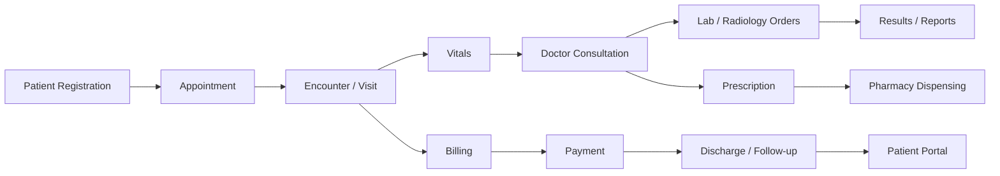

---

## 16. Branch-Level Data Access Scenarios

### Scenarios

- Receptionist can see only their branch appointments.
- Doctor can see assigned branch patients and encounters.
- Pharmacist can see only branch pharmacy stock.
- Lab technician can see only branch lab orders.
- Hospital admin can see all branches of same hospital.
- Tenant admin can see all hospitals under same tenant.
- Platform admin can manage subscription/support but not clinical data by default.

### Branch-Level Access Flow

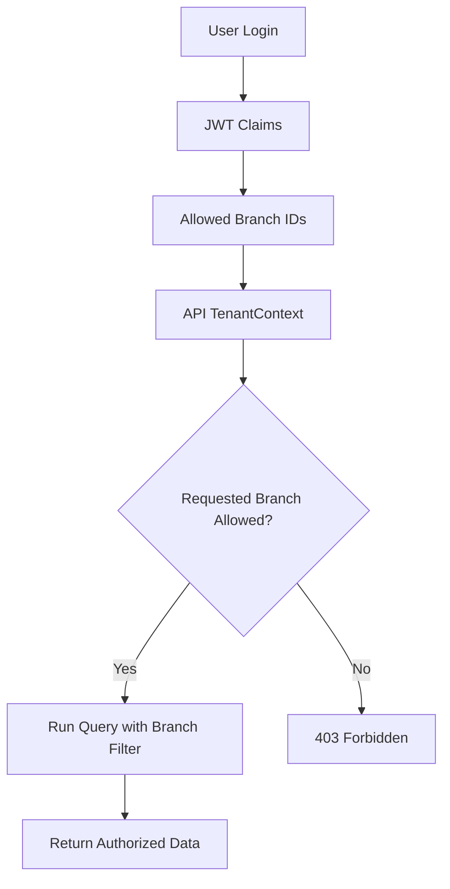

### Access Matrix

| Role | Tenant Data | Hospital Data | Branch Data | Patient Clinical Data | Billing Data | Reports | Settings |
| --- | --- | --- | --- | --- | --- | --- | --- |
| Platform Super Admin | Metadata | Metadata | Metadata | No by default | No by default | Platform only | Platform |
| Tenant Admin | Yes | Yes | Yes | Configurable | Configurable | Tenant | Tenant |
| Hospital Admin | No | Own hospital | All branches | Configurable | Yes | Hospital | Hospital |
| Branch Admin | No | Own hospital | Own branch | Configurable | Branch | Branch | Branch |
| Doctor | No | Assigned | Assigned | Assigned patients | Limited | Clinical | No |
| Nurse | No | Assigned | Assigned | Ward/assigned | No | Nursing | No |
| Receptionist | No | Assigned | Own branch | Registration only | Limited | Queue | No |
| Lab Technician | No | Assigned | Own branch | Lab context | No | Lab | No |
| Pharmacist | No | Assigned | Own branch | Prescription context | Pharmacy billing only | Pharmacy | No |
| Billing User | No | Assigned | Own branch | Billing context | Yes | Billing | No |

---

## 17. API and Microservices Alignment

Backend should follow Spring Boot microservices architecture or modular service architecture.

### Recommended Services

- Auth Service
- Super Admin Service
- Hospital Service
- Patient Service
- Doctor Service
- Appointment Service
- Lab Service
- Billing Service
- Prescription Service
- Pharmacy Service
- Radiology Service
- Surgery Service
- FHIR Gateway Service
- HL7 Integration Service
- Reporting Service
- Notification Service
- Audit Service

Each service must enforce:

- JWT Authentication Filter.
- TenantContext and BranchContext.
- Role-Based Access Control.
- NamedParameterJdbcTemplate/JDBC if project follows no-JPA approach.
- Global exception handling.
- Audit logging.
- Structured logs.
- Idempotency for critical operations.
- Transactions for billing, pharmacy, lab order, discharge, insurance claims.

### Service Deployment Diagram

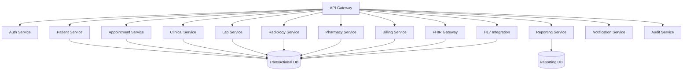

---

## 18. Reporting and Analytics

Heavy reports should not run directly from transactional tables. Use:

- Summary tables.
- Materialized views if supported.
- Scheduled aggregation jobs.
- Event-based aggregation.
- Audit-safe reporting.
- Branch-wise dashboards.
- Hospital-wise dashboards.
- Tenant-wise dashboards.

### Report Examples

- Daily OPD count.
- IPD occupancy.
- Department revenue.
- Doctor productivity.
- Lab test volume.
- Pharmacy sales.
- Billing collection.
- Insurance pending claims.
- Discharge TAT.
- Emergency waiting time.
- Patient satisfaction score.

---

## 19. Compliance and Audit

The system should support:

- Audit logs.
- Access logs.
- Change history.
- Data masking.
- Role-based access.
- Emergency break-glass access.
- Consent tracking.
- Document versioning.
- HL7/FHIR message traceability.
- Patient data export.
- Retention policies.

### Audit Table Examples

- `audit_logs`
- `user_login_history`
- `patient_record_access_logs`
- `fhir_api_audit_log`
- `hl7_message_log`
- `consent_records`

### Audit Logging Flow

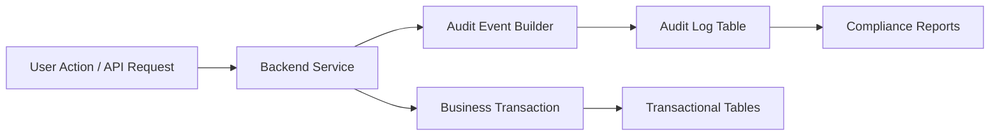

---

## 20. Recommended Indexing Strategy

Every major transaction table should include indexes on:

- `tenant_id`, `hospital_id`, `branch_id`
- `patient_id`
- `encounter_id`
- `appointment_date`
- `invoice_date`
- `order_date`
- `status`
- `created_at`
- Composite indexes for tenant/hospital/branch/date/status

### SQL Examples

```sql
CREATE INDEX idx_patient_tenant_hospital
ON patients (tenant_id, hospital_id, mrn);

CREATE INDEX idx_encounter_branch_date
ON encounters (tenant_id, hospital_id, branch_id, start_time);

CREATE INDEX idx_invoice_branch_date
ON billing_invoices (tenant_id, hospital_id, branch_id, invoice_date);

CREATE INDEX idx_lab_order_status
ON lab_orders (tenant_id, hospital_id, branch_id, status, ordered_at);
```

---

## 21. Backup and Disaster Recovery Strategy

| Strategy | Description |
| --- | --- |
| SaaS shared DB backup | Full database backup with point-in-time recovery |
| Hospital-wise logical backup | Export by `tenant_id` / `hospital_id` for enterprise needs |
| Branch-wise restore | Requires careful restore rules to avoid cross-branch inconsistency |
| Enterprise dedicated backup | Dedicated database backup for enterprise clients |
| Point-in-time recovery | Required for accidental delete/corruption |
| Audit log retention | Keep audit logs according to legal policy |
| FHIR/HL7 replay | Store messages so failed integrations can be replayed |

### Enterprise Deployment Options

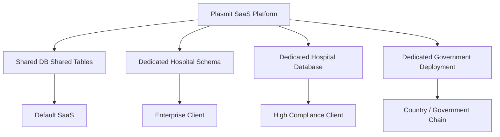

---

## 22. Implementation Roadmap

| Phase | Name | Scope |
| --- | --- | --- |
| Phase 1 | Foundation | Tenant, hospital, branch, users, roles, patient, appointment |
| Phase 2 | Clinical Core | Encounter, vitals, diagnosis, prescription, doctor workbench |
| Phase 3 | Revenue Cycle | Billing, payments, refunds, insurance |
| Phase 4 | Diagnostics and Pharmacy | Lab, radiology, pharmacy, inventory |
| Phase 5 | FHIR/HL7 Layer | FHIR mapping, HL7 listener, integration logs, API gateway |
| Phase 6 | Advanced Modules | IPD, emergency, surgery, discharge, nursing |
| Phase 7 | Analytics and AI | Patient journey command center, reporting summary, dashboards |

---

## 23. Final Recommendation

The recommended database architecture is:

- Default architecture should be shared database + shared tables.
- Every transaction table must contain `tenant_id`, `hospital_id`, and `branch_id`.
- Patient should be hospital-level or tenant-level depending on MPI strategy.
- Encounter should be branch-level.
- Use normalized tables for transactional correctness.
- Use denormalized summary tables for dashboards and reporting.
- Build FHIR as an interoperability layer, not as the only database structure.
- Maintain HL7 message logs for interoperability with legacy systems.
- Use optional schema/database-per-hospital only for enterprise/government clients.
- Never trust frontend for tenant/branch isolation.
- Backend must enforce data access using JWT claims and TenantContext.

> **Board-Level Recommendation:** Adopt the hybrid multi-tenant architecture now. It gives SaaS speed, enterprise flexibility, and future regulatory/interoperability readiness.

---

## 24. Appendix

### Glossary

| Term | Meaning |
| --- | --- |
| Tenant | SaaS customer or hospital group |
| Hospital | Legal healthcare provider organization |
| Branch | Facility/location under a hospital |
| Encounter | Actual visit/admission/emergency context |
| MPI | Master Patient Index |
| PHI | Protected Health Information |
| FHIR | Fast Healthcare Interoperability Resources |
| HL7 v2 | Legacy healthcare messaging standard |
| LIS | Laboratory Information System |
| RIS | Radiology Information System |
| PACS | Picture Archiving and Communication System |

### FHIR Resource Glossary

| Resource | Meaning |
| --- | --- |
| Patient | Person receiving care |
| Encounter | Care event context |
| Observation | Vitals, measurements, results |
| Condition | Diagnosis/problem |
| ServiceRequest | Lab/radiology/procedure order |
| DiagnosticReport | Report header/result grouping |
| MedicationRequest | Prescription/medication order |
| Medication | Medicine definition |
| MedicationDispense | Pharmacy dispense |
| DocumentReference | Documents/files/reports |
| Claim | Insurance claim |
| AuditEvent | Audit trail |

### HL7 Message Glossary

| Message | Meaning |
| --- | --- |
| ADT | Admission, discharge, transfer |
| ORM | Order message |
| ORU | Observation/result message |
| SIU | Scheduling message |
| DFT | Financial transaction |
| MDM | Medical document management |

### Sample SQL Query Pattern

```sql
SELECT *
FROM encounters
WHERE tenant_id = :tenantId
AND hospital_id = :hospitalId
AND branch_id IN (:allowedBranchIds)
AND is_deleted = 0
ORDER BY start_time DESC;
```

### Database Naming Convention

| Object | Convention | Example |
| --- | --- | --- |
| Table | plural snake_case | `billing_invoices` |
| Primary key | `id` | `id BIGINT` |
| Foreign key | singular table name + `_id` | `patient_id` |
| Index | `idx_table_columns` | `idx_encounter_branch_date` |
| Unique key | `uk_table_columns` | `uk_patient_mrn` |
| Audit table | entity + `_audit` or central `audit_logs` | `audit_logs` |

---

## 25. Final Deliverable Summary

### Suggested File Name

`FHIR-HL7-Ready-Multi-Tenant-HMS-Database-Architecture-Blueprint-v1.0.docx`

### Suggested Document Sections

- Cover Page
- Executive Summary
- Multi-Tenant Architecture Options
- Data Hierarchy
- FHIR Mapping
- HL7 Integration
- Security and Data Isolation
- Normalization and Denormalization
- Foundation Tables
- Module Coverage
- Access Matrix
- Microservices Alignment
- Reporting and Analytics
- Compliance and Audit
- Roadmap
- Final Recommendation
- Appendix

### Diagrams Included

1. Overall SaaS architecture
2. Tenant to clinical data hierarchy
3. Data isolation model
4. FHIR integration layer
5. HL7 inbound/outbound message flow
6. Patient journey flow
7. Encounter-centric clinical data model
8. Normalized to denormalized reporting flow
9. Security access flow using JWT
10. Audit logging flow
11. Branch-level access control flow
12. Enterprise deployment options
13. Microservices deployment alignment

### FHIR Resources Covered

- Organization
- Location
- HealthcareService
- Practitioner
- PractitionerRole
- Patient
- Appointment
- Encounter
- Observation
- Condition
- Procedure
- MedicationRequest
- Medication
- MedicationDispense
- ServiceRequest
- DiagnosticReport
- DocumentReference
- AllergyIntolerance
- Immunization
- CarePlan
- Account
- ChargeItem
- Claim
- ExplanationOfBenefit
- AuditEvent

### Modules Covered

Super Admin, Tenant Admin, Hospital Setup, Branch Management, Department Management, User/Role/Permission, Patient Registration, Appointment, OPD, IPD, Emergency, Nursing, Doctor Workbench, EMR, Vitals, Diagnosis, Prescription, Pharmacy Inventory, Pharmacy Dispensing, Lab, Radiology, OT/Surgery, Ward/Bed, Billing, Payments, Insurance, Discharge, Documents, Patient Portal, Doctor Portal, HR/Attendance, Inventory/Store, Procurement, Ambulance, Blood Bank, Diet/Kitchen, Housekeeping, Maintenance, Helpdesk, Notifications, Audit, HL7, FHIR, Analytics, AI Patient Journey Command Center.

### Next Implementation Steps

1. Approve the hybrid multi-tenant architecture.
2. Finalize tenant/hospital/branch master tables.
3. Define global RBAC permissions.
4. Create normalized transactional schema.
5. Add branch-level access middleware in backend.
6. Build FHIR mapping registry and resource store.
7. Build HL7 message log and parser service.
8. Create summary tables for dashboards.
9. Implement audit and access logs.
10. Start with Foundation and Clinical Core phases.

---

## References

- HL7 FHIR R4 Patient: https://hl7.org/fhir/R4/patient.html
- HL7 FHIR R4 Encounter: https://hl7.org/fhir/R4/encounter.html
- HL7 FHIR R4 Observation: https://hl7.org/fhir/R4/observation.html
- HL7 FHIR R4 ServiceRequest: https://hl7.org/fhir/R4/servicerequest.html
- HL7 FHIR R4 DiagnosticReport: https://hl7.org/fhir/R4/diagnosticreport.html
- HL7 FHIR R4 MedicationRequest: https://hl7.org/fhir/R4/medicationrequest.html
- HL7 Standards Overview: https://www.hl7.org/implement/standards/

