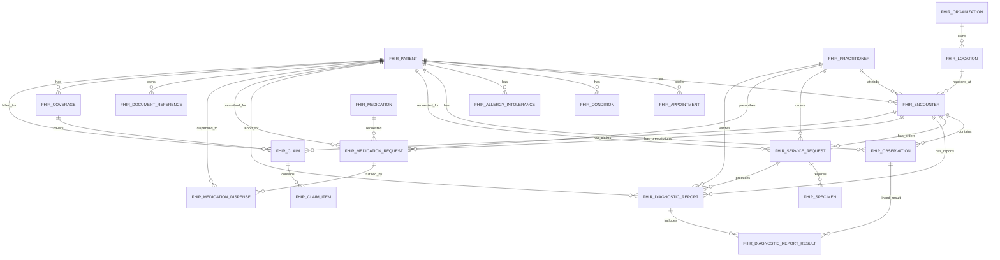

# FHIR MySQL Database Design Document

## 1. Purpose

This document describes a practical MySQL database design for storing FHIR-style hospital data. The design is intended for a hospital/clinical application that needs patient registration, encounters, vitals, lab/radiology orders, reports, medications, documents, insurance, billing claims, audit logs, indexes, triggers, and stored procedures.

FHIR means **Fast Healthcare Interoperability Resources**. FHIR is resource-based, not purely relational. Because of that, this database uses a hybrid model:

- Relational columns for fast search, filtering, reporting, joins, and indexes.
- `raw_json JSON` column to preserve the complete FHIR resource payload.

## 2. Files Created

| File | Purpose |
| --- | --- |
| `database/fhir_mysql_schema.sql` | Complete MySQL script with tables, indexes, triggers, stored procedures, and views |
| `docs/fhir-mysql-database-design.md` | Human-readable design document |
| `docs/fhir-mysql-database-design.docx` | Word document version of this design |

## 3. Design Approach

### Why Relational + JSON

FHIR resources can contain nested arrays, codings, identifiers, extensions, references, and metadata. A fully normalized FHIR database can become very large and difficult to query. A fully JSON-only database is flexible but slow for dashboards and reporting.

This design keeps both:

```txt
Important searchable fields -> relational columns
Full original FHIR resource -> raw_json JSON
```

Example:

```txt
Patient.name, Patient.identifier, Patient.phone -> columns
Full Patient resource -> raw_json
```

## 4. High-Level ER Diagram



## 5. Main Tables

### Generic and Audit

| Table | Purpose |
| --- | --- |
| `fhir_resource` | Generic resource storage for raw resource metadata |
| `fhir_audit_event` | Audit trail for inserts/updates and user activity |

### Master Tables

| Table | Purpose |
| --- | --- |
| `fhir_organization` | Hospital, branch, payer, insurer, provider |
| `fhir_location` | Ward, bed, room, department, branch location |
| `fhir_practitioner` | Doctor, nurse, technician, pharmacist |

### Patient and Visit

| Table | Purpose |
| --- | --- |
| `fhir_patient` | Patient demographic and identifier data |
| `fhir_patient_identifier` | Multiple identifiers per patient |
| `fhir_appointment` | Scheduled patient appointment |
| `fhir_encounter` | Actual OPD/IPD/emergency visit context |

### Clinical

| Table | Purpose |
| --- | --- |
| `fhir_condition` | Diagnoses and clinical conditions |
| `fhir_allergy_intolerance` | Allergy and intolerance data |
| `fhir_observation` | Vitals, lab values, measured results |
| `fhir_service_request` | Lab/radiology/procedure orders |
| `fhir_specimen` | Sample/specimen collection data |
| `fhir_diagnostic_report` | Lab/radiology report header |
| `fhir_diagnostic_report_result` | Link table between report and observations |
| `fhir_procedure` | Procedures performed |

### Medication

| Table | Purpose |
| --- | --- |
| `fhir_medication` | Medicine master/batch-level medication info |
| `fhir_medication_request` | Prescription/medicine order |
| `fhir_medication_dispense` | Pharmacy dispense event |

### Document, Insurance, Billing

| Table | Purpose |
| --- | --- |
| `fhir_document_reference` | Patient files, PDFs, discharge summary, reports |
| `fhir_coverage` | Insurance/payer coverage |
| `fhir_claim` | Billing/insurance claim |
| `fhir_claim_item` | Claim line items |

## 6. Common Columns

Most resource tables contain:

```sql
id CHAR(36) PRIMARY KEY
fhir_id VARCHAR(100)
status VARCHAR(...)
raw_json JSON
created_at TIMESTAMP
updated_at TIMESTAMP
```

Recommended usage:

```txt
id       -> internal database UUID
fhir_id  -> FHIR logical id from integration/API
raw_json -> full FHIR resource JSON
```

## 7. Index Strategy

Indexes are added for:

- Patient search: identifier, MRN, ABHA, phone, name
- Encounter dashboard: patient, status, class, location, start time
- Observation result lookup: patient, encounter, code, effective time
- Diagnostic reports: patient, encounter, status, issued time
- Medication requests: patient, encounter, status, authored time
- Claims: patient, encounter, status, billing period
- Audit: resource type, resource id, user, action time

Example:

```sql
KEY idx_observation_code_time (code, effective_time)
KEY idx_encounter_class_status (class_code, status)
FULLTEXT KEY ft_patient_name_phone_identifier (name, phone, identifier)
```

## 8. Trigger Strategy

The SQL script includes:

### UUID Triggers

Every major table has a `BEFORE INSERT` trigger that sets `id = UUID()` when no id is provided.

Example:

```sql
CREATE TRIGGER trg_patient_bi BEFORE INSERT ON fhir_patient
FOR EACH ROW BEGIN
  IF NEW.id IS NULL OR NEW.id = '' THEN SET NEW.id = UUID(); END IF;
END
```

### Audit Triggers

Audit triggers are added for important resource changes:

- Patient insert/update
- Encounter insert/update
- Observation insert
- MedicationRequest insert
- DiagnosticReport insert

These triggers insert rows into `fhir_audit_event`.

## 9. Stored Procedures

The script includes these stored procedures:

| Procedure | Purpose |
| --- | --- |
| `sp_upsert_patient` | Insert or update patient by FHIR id/identifier |
| `sp_create_encounter` | Create OPD/IPD/emergency encounter |
| `sp_close_encounter` | Mark encounter as finished |
| `sp_record_observation` | Record vital/lab observation |
| `sp_create_service_request` | Create lab/radiology/procedure order |
| `sp_create_diagnostic_report` | Create diagnostic report |
| `sp_prescribe_medication` | Create medication request/prescription |
| `sp_search_patient` | Search patient by name, phone, identifier, MRN, ABHA |
| `sp_get_patient_summary` | Return patient, recent encounters, observations, medications |
| `sp_get_patient_timeline` | Combined patient timeline |

## 10. Views

The script creates:

| View | Purpose |
| --- | --- |
| `vw_patient_current_encounters` | Active encounter dashboard |
| `vw_patient_latest_vitals` | Latest vitals/observation style query base |

## 11. How To Run SQL Script

Using MySQL CLI:

```bash
mysql -u root -p < database/fhir_mysql_schema.sql
```

The script uses `CREATE TABLE IF NOT EXISTS`, `DROP TRIGGER IF EXISTS`, and `DROP PROCEDURE IF EXISTS` for repeat-friendly development runs. If you want a clean rebuild with all old data removed, back up data first and then drop the `fhir_hms` database manually.

Using MySQL Workbench:

1. Open MySQL Workbench.
2. Connect to server.
3. Open `database/fhir_mysql_schema.sql`.
4. Execute the full script.
5. Database `fhir_hms` will be created.

## 12. Example Procedure Usage

```sql
SET @patient_id = NULL;

CALL sp_upsert_patient(
  'patient-001',
  'UHID-240221',
  'Aisha Khan',
  'female',
  '2018-04-12',
  '9876543210',
  JSON_OBJECT('resourceType', 'Patient', 'id', 'patient-001'),
  'system-admin',
  @patient_id
);

SELECT @patient_id;
```

## 13. Recommended Backend Integration

Frontend/API should not directly write all tables manually. Recommended flow:

```txt
Frontend form -> Backend API -> Validation -> Stored procedure/table write -> Audit trigger
```

Example API:

```txt
POST /api/fhir/patient
POST /api/fhir/encounter
POST /api/fhir/observation
POST /api/fhir/service-request
POST /api/fhir/diagnostic-report
POST /api/fhir/medication-request
```

## 14. Important Notes

- This schema is a practical FHIR-style schema, not a full official FHIR server implementation.
- Keep `raw_json` to preserve original FHIR resources.
- Use relational columns for fields needed in dashboards, filters, reports, and joins.
- For full interoperability, validate resources against official FHIR profiles in the backend.
- Add more extension tables only when reporting/searching requires them.

## 15. Official FHIR References

- HL7 FHIR R4 Patient: https://hl7.org/fhir/R4/patient.html
- HL7 FHIR R4 Encounter: https://hl7.org/fhir/R4/encounter.html
- HL7 FHIR R4 Observation: https://hl7.org/fhir/R4/observation.html
- HL7 FHIR R4 ServiceRequest: https://hl7.org/fhir/R4/servicerequest.html
- HL7 FHIR R4 DiagnosticReport: https://hl7.org/fhir/R4/diagnosticreport.html
- HL7 FHIR R4 MedicationRequest: https://hl7.org/fhir/R4/medicationrequest.html
