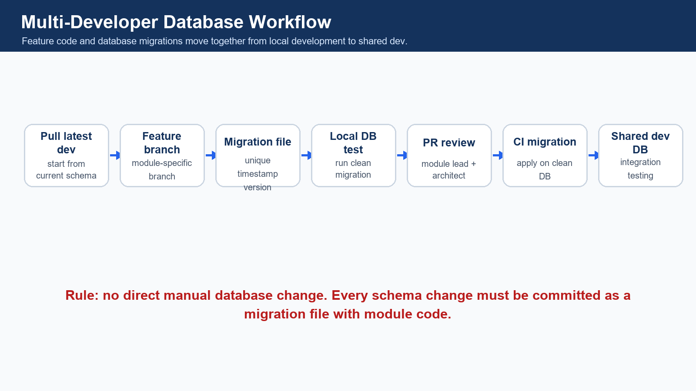
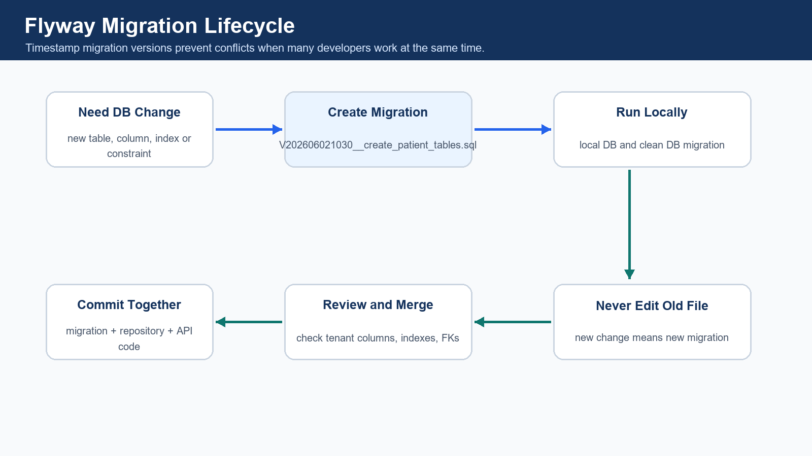
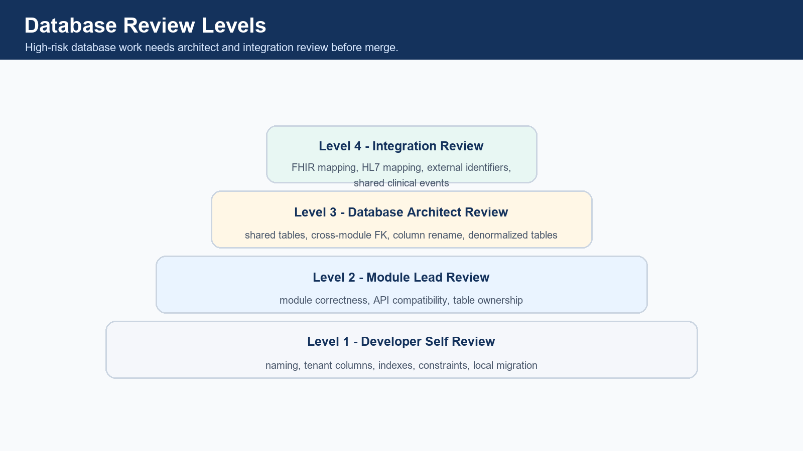
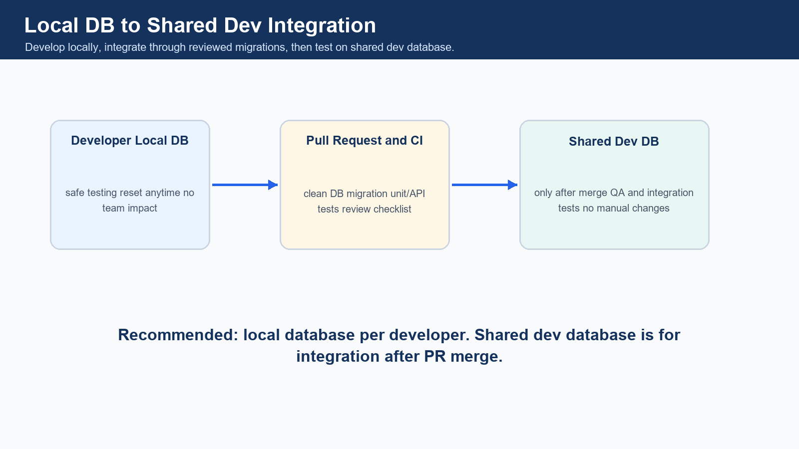
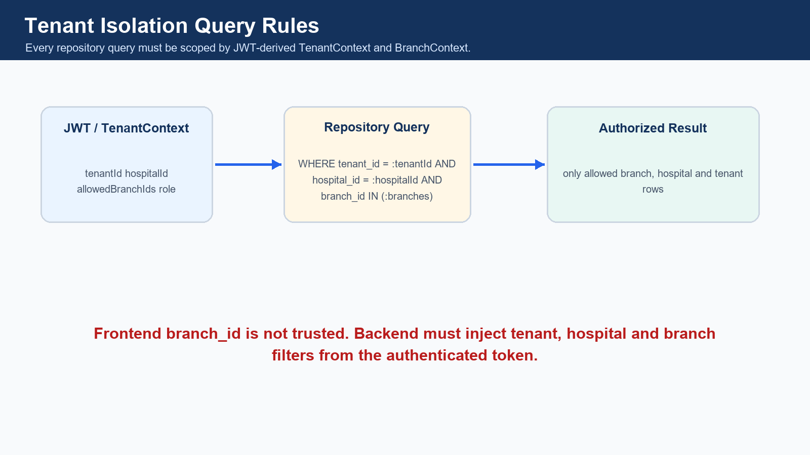
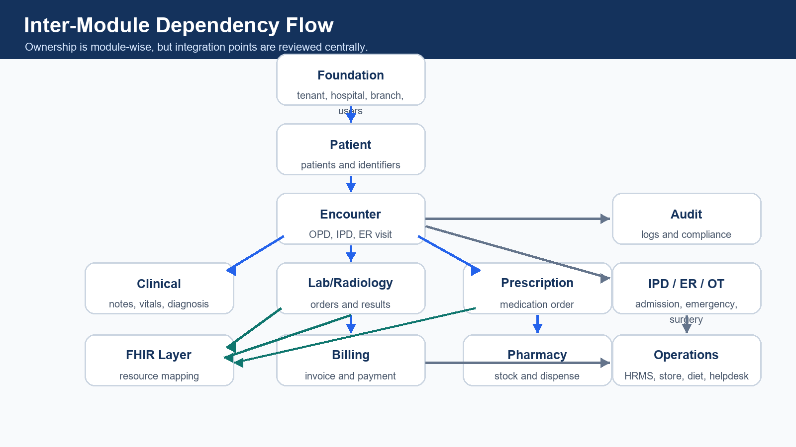
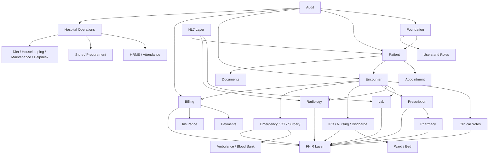

# Multi-Developer Database Development Workflow for Plasmit Hospital Management System

**Project context:** Spring Boot microservices, Java 17, MySQL, JDBC/NamedParameterJdbcTemplate, Flyway, GitHub/GitLab workflow, Postman API testing, multi-tenant isolation using `tenant_id`, `hospital_id` and `branch_id`.

## 1. Executive Summary

This workflow explains how 8-12 developers can build database and backend modules at the same time without conflicts, duplicate tables, broken migrations or tenant isolation mistakes.

Without a workflow, common problems appear quickly: two developers create the same migration version, two modules create duplicate patient/order tables, shared tables are changed without review, queries miss tenant filters, and FHIR/HL7 mappings become inconsistent.

The recommended approach is:

- Use Flyway as the default migration tool.
- Use timestamp-based migration files for parallel development.
- Use local database per developer.
- Apply migrations to shared dev database only after PR merge.
- Commit migration files together with service, repository and API code.
- Enforce `tenant_id`, `hospital_id` and `branch_id` in tables and queries.
- Assign clear module and table ownership.
- Require architect review for shared tables, cross-module foreign keys, denormalized tables and FHIR/HL7 mapping tables.



## 2. Core Rules for All Developers

- Never directly alter the shared database manually.
- Every table change must go through a migration file.
- Every major table must include `tenant_id`, `hospital_id` and `branch_id` where applicable.
- Every table must include audit columns.
- Every query must filter by tenant, hospital and branch where applicable.
- Every module developer owns only assigned module tables.
- Shared master tables need database architect approval.
- Do not duplicate existing tables.
- Do not create random naming.
- Do not remove or rename columns without migration review.
- Do not add FHIR/HL7 mapping randomly without integration team review.
- Never edit an already merged migration file.

## 3. Team Distribution Model

> Coverage update: Developer C owns the full clinical core: OPD, doctor workbench, EMR, vitals, diagnosis, allergy, care plan, clinical orders and prescription. Developer L has been added for HRMS, store, procurement, diet, housekeeping, maintenance, helpdesk and portals.

| Developer | Owned Modules | Owned Tables | Dependent Modules | Migration Ownership | API Testing Responsibility | Review Dependency |
| --- | --- | --- | --- | --- | --- | --- |
| Developer A | SaaS Foundation / Tenant / Hospital / Branch / Department / User / Role / Permission | tenants, subscriptions, hospitals, branches, departments, healthcare_services, users, roles, permissions, user_branch_access | All modules | Foundation and access-control migrations | Auth, tenant setup, hospital setup, branch setup, RBAC APIs | Database Architect + Security Lead |
| Developer B | Patient Registration / MPI / Patient Contacts / Patient Documents / Appointment / Queue | patients, patient_identifiers, patient_addresses, patient_contacts, patient_documents, appointments, appointment_slots, appointment_queues, appointment_status_history | Foundation, Clinical, Billing, Lab, Pharmacy | Patient and appointment migrations | Registration, MPI search, appointment, queue, patient document APIs | Foundation + Clinical + FHIR team |
| Developer C | Complete Clinical Core / OPD / Doctor Workbench / EMR / Vitals / Diagnosis / Allergy / Care Plan / Clinical Orders / Prescription | doctors, doctor_schedules, encounters, encounter_participants, clinical_notes, emr_documents, vitals, diagnoses, problem_lists, patient_allergies, care_plans, clinical_orders, prescriptions, prescription_items | Patient, Appointment, Lab, Radiology, Pharmacy, Billing | Clinical and prescription migrations | Doctor workbench, OPD, EMR, vitals, diagnosis, allergy, care plan, prescription APIs | Patient + Diagnostics + Pharmacy + FHIR team |
| Developer D | Lab / Diagnostics / Sample Collection / Result Entry / Critical Alerts / Radiology / Imaging Reports | lab_orders, lab_order_items, lab_samples, lab_results, lab_result_flags, diagnostic_reports, radiology_orders, radiology_reports, radiology_images | Patient, Encounter, Billing, FHIR/HL7 | Lab and radiology migrations | Lab order, token/queue, sample, result, radiology report APIs | Clinical + Billing + FHIR/HL7 team |
| Developer E | Pharmacy / Medicine Master / Batch / Stock / Prescription Dispensing / Sales / Returns | medicines, medicine_categories, medicine_batches, pharmacy_stock, pharmacy_stock_movements, pharmacy_sales, pharmacy_sale_items, pharmacy_returns, medication_dispenses | Prescription, Billing, Inventory | Pharmacy migrations | Medicine master, stock, low-stock, expiry, dispensing, sales APIs | Clinical + Billing + FHIR team |
| Developer F | Billing / Invoicing / Payments / Refunds / Package Billing / Insurance / TPA / Claims | billing_invoices, billing_invoice_items, billing_packages, payments, payment_allocations, refunds, insurance_policies, insurance_claims, claim_documents, claim_status_history | Patient, Encounter, Lab, Radiology, Pharmacy, IPD | Billing, payment and insurance migrations | Invoice, payment, refund, package, claim, receipt APIs | Architect + Reporting + Integration team |
| Developer G | IPD / Admission / Ward / Room / Bed / Nursing / Medication Administration / Discharge Summary | admissions, admission_transfers, wards, rooms, beds, bed_allocations, nursing_notes, nursing_tasks, medication_administrations, discharge_checklists, discharge_summaries, followups | Patient, Encounter, Clinical, Billing | IPD, nursing and discharge migrations | Admission, transfer, bed, nursing, MAR, discharge, follow-up APIs | Clinical + Billing + FHIR team |
| Developer H | Emergency / ER / Triage / Surgery / OT / Ambulance / Blood Bank | emergency_cases, triage_assessments, emergency_orders, surgeries, operation_theatres, surgery_team, surgery_checklists, anesthesia_records, ambulance_requests, blood_donors, blood_bank_units, blood_transfusions | Patient, Encounter, Clinical, Billing, Inventory | Emergency, OT, ambulance and blood bank migrations | ER queue, triage, OT, surgery, ambulance, blood bank APIs | Clinical + Billing + Architect |
| Developer I | FHIR Gateway / HL7 Integration / External System Mapping / Identifier Mapping | fhir_resource_mapping, fhir_resource_store, fhir_api_audit_log, fhir_sync_status, fhir_code_system_mapping, hl7_message_log, hl7_message_error_log, hl7_mapping, external_identifier_mapping, integration_endpoints | All clinical, billing, patient and master modules | FHIR, HL7 and integration migrations | FHIR API, HL7 inbound/outbound, mapping, replay and partner integration tests | Architect + Module Owners |
| Developer J | Reporting / Dashboard / Denormalized Summary Tables / Analytics / AI Patient Journey Command Center | daily_branch_revenue_summary, daily_patient_visit_summary, department_wise_collection_summary, doctor_performance_summary, lab_test_volume_summary, pharmacy_stock_snapshot, bed_occupancy_summary, patient_journey_summary, ai_alerts | All modules | Reporting and analytics migrations | Dashboard, summary refresh, command center, AI alert data APIs | Architect + Module Owners + Compliance |
| Developer K | Audit / Compliance / Consent / Notification / Security Logs / Access Logs | audit_logs, user_login_history, patient_record_access_logs, consent_records, break_glass_access_logs, notifications, notification_templates, notification_delivery_logs, security_events | All modules | Audit, compliance and notification migrations | Audit, access log, consent, notification, security event APIs | Security Lead + Compliance + Architect |
| Developer L | Hospital Operations / HRMS / Staff Attendance / Store Inventory / Procurement / Diet Kitchen / Housekeeping / Maintenance / Helpdesk / Patient Portal / Doctor Portal | staff_profiles, staff_attendance, staff_shifts, inventory_items, store_stock, stock_requisitions, purchase_orders, purchase_order_items, goods_receipts, vendor_master, diet_orders, kitchen_menus, housekeeping_tasks, maintenance_tickets, helpdesk_tickets, portal_users, portal_sessions | Foundation, Billing, IPD, Pharmacy, Patient | Operations, HRMS, inventory, procurement, portal migrations | Staff attendance, inventory, purchase, diet, housekeeping, maintenance, helpdesk, patient portal and doctor portal APIs | Hospital Admin + Billing + Security + Architect |

## 4. Database Ownership Matrix

| Module | Table Prefix | Owner | Primary Tables | Shared Dependencies | FHIR Resources | Review Required From |
| --- | --- | --- | --- | --- | --- | --- |
| Super Admin / SaaS Admin | tenant_, subscription_ | Developer A | tenants, subscription_plans, tenant_subscriptions, tenant_settings | None | Organization | Architect |
| Tenant / Hospital Group Admin | tenant_, hospital_ | Developer A | tenants, hospitals, hospital_groups, tenant_admin_users | SaaS foundation | Organization | Architect |
| Hospital Setup | hospital_ | Developer A | hospitals, healthcare_services, hospital_settings, hospital_documents | Tenant | Organization, HealthcareService, DocumentReference | Architect + Compliance |
| Branch / Facility Management | branch_, location_ | Developer A | branches, branch_locations, counters, branch_settings | Hospital | Location | Architect |
| Department Management | department_, service_ | Developer A | departments, department_services, service_catalog | Hospital, Branch | HealthcareService | Architect |
| User / Role / Permission | user_, role_, permission_ | Developer A | users, roles, permissions, role_permissions, user_branch_access, practitioner_roles | Hospital, Branch | Practitioner, PractitionerRole | Security Lead |
| Patient Registration / MPI | patient_ | Developer B | patients, patient_identifiers, patient_addresses, patient_contacts, patient_merge_history | Foundation | Patient, RelatedPerson | Foundation + FHIR team |
| Patient Documents | patient_document_, document_ | Developer B | patient_documents, documents, document_versions, document_access_logs | Patient, Encounter | DocumentReference | Clinical + FHIR team |
| Patient Portal | portal_ | Developer L | portal_users, portal_sessions, portal_patient_links, portal_document_access | Patient, Auth, Documents | Patient, DocumentReference | Security + Patient team |
| Doctor Portal | doctor_portal_ | Developer L | doctor_portal_profiles, doctor_portal_sessions, doctor_task_views | Doctor, Clinical, Appointment | Practitioner, Encounter | Security + Clinical team |
| Appointment Scheduling | appointment_ | Developer B | appointments, appointment_slots, appointment_queues, appointment_status_history, appointment_reminders | Patient, Users, Branch | Appointment | Foundation + Notification team |
| Encounter / Visit | encounter_ | Developer C | encounters, encounter_participants, encounter_status_history, encounter_locations | Patient, Appointment, Branch, Doctor | Encounter | Patient + Clinical team |
| OPD Management | opd_ | Developer C | opd_visits, opd_queue, doctor_consultations, consultation_status_history | Patient, Appointment, Encounter | Encounter, Observation, Condition | Patient + FHIR team |
| Doctor Workbench | doctor_, clinical_ | Developer C | doctor_schedules, doctor_tasks, clinical_orders, doctor_review_queue | Encounter, Lab, Radiology, Prescription | PractitionerRole, ServiceRequest | Clinical Lead |
| Clinical Notes / EMR | clinical_, emr_ | Developer C | clinical_notes, emr_documents, progress_notes, procedure_notes, discharge_clinical_notes | Encounter, Doctor | DocumentReference, Composition | FHIR team |
| Vitals and Observation | vital_, observation_ | Developer C | vitals, observation_records, nursing_observations, growth_charts | Encounter, Nursing | Observation | Clinical + FHIR team |
| Diagnosis / Problem List | diagnosis_, problem_ | Developer C | diagnoses, problem_lists, diagnosis_status_history | Encounter, Doctor | Condition | Clinical + FHIR team |
| Allergy / Immunization / Care Plan | allergy_, immunization_, care_plan_ | Developer C | patient_allergies, immunizations, care_plans, care_plan_goals | Patient, Encounter | AllergyIntolerance, Immunization, CarePlan | FHIR team |
| Prescription / Medication Order | prescription_, medication_order_ | Developer C | prescriptions, prescription_items, medication_orders, medication_order_status_history | Encounter, Pharmacy | MedicationRequest | Pharmacy + FHIR team |
| Nursing Module | nursing_ | Developer G | nursing_notes, nursing_tasks, nursing_handover, medication_administrations, fluid_balance_records | IPD, Encounter, Clinical | Observation, MedicationAdministration | Clinical + FHIR team |
| IPD / Admission Management | admission_, ipd_ | Developer G | admissions, admission_transfers, ipd_rounds, ipd_care_team | Patient, Encounter, Ward | Encounter | Clinical + Billing |
| Ward / Room / Bed Management | ward_, room_, bed_ | Developer G | wards, rooms, beds, bed_allocations, bed_transfer_history | Branch, IPD | Location | Hospital Admin |
| Discharge Summary | discharge_ | Developer G | discharge_checklists, discharge_summaries, discharge_medications, followups | IPD, Clinical, Billing | DocumentReference, CarePlan | Clinical + Billing + FHIR |
| Lab / Diagnostics | lab_ | Developer D | lab_orders, lab_order_items, lab_samples, lab_results, lab_result_flags, diagnostic_reports | Encounter, Billing | ServiceRequest, Observation, DiagnosticReport | FHIR/HL7 team |
| Radiology / Imaging | radiology_ | Developer D | radiology_orders, radiology_reports, radiology_images, radiology_report_reviews | Encounter, Billing | ServiceRequest, DiagnosticReport, ImagingStudy | FHIR/HL7 team |
| Pharmacy Master / Inventory | medicine_, pharmacy_stock_ | Developer E | medicines, medicine_categories, medicine_batches, pharmacy_stock, pharmacy_stock_movements | Hospital, Branch, Store | Medication | Inventory + FHIR team |
| Pharmacy Sales / Dispensing | pharmacy_sale_, medication_dispense_ | Developer E | pharmacy_sales, pharmacy_sale_items, pharmacy_returns, medication_dispenses | Prescription, Billing, Stock | MedicationDispense | Billing + FHIR team |
| Billing / Invoicing | billing_ | Developer F | billing_invoices, billing_invoice_items, billing_packages, charge_master, patient_accounts | Patient, Encounter, Services | Account, ChargeItem | Architect + Reporting |
| Payment / Refunds | payment_, refund_ | Developer F | payments, payment_allocations, refunds, receipt_print_logs | Billing | ExplanationOfBenefit | Finance Lead |
| Insurance / TPA / Claims | insurance_, claim_ | Developer F | insurance_policies, insurance_claims, claim_documents, claim_status_history, tpa_master | Billing, Patient | Coverage, Claim, ExplanationOfBenefit | Architect + Integration |
| Emergency / ER | emergency_, triage_ | Developer H | emergency_cases, triage_assessments, emergency_orders, emergency_transfer_logs | Patient, Encounter, Billing | Encounter, Observation, ServiceRequest | Clinical + Billing |
| OT / Surgery Management | surgery_, ot_ | Developer H | surgeries, operation_theatres, surgery_team, surgery_checklists, anesthesia_records | Encounter, Billing, Inventory | Procedure | Clinical + Architect |
| Ambulance | ambulance_ | Developer H | ambulances, ambulance_requests, ambulance_trips, ambulance_staff_assignments | Patient, Emergency, Billing | Encounter, Location | Operations + Billing |
| Blood Bank | blood_ | Developer H | blood_donors, blood_bank_units, blood_requests, blood_transfusions, blood_screening_results | Patient, Lab, Billing | Observation, Procedure | Clinical + Compliance |
| Staff Attendance / HRMS | staff_, attendance_ | Developer L | staff_profiles, staff_attendance, staff_shifts, leave_requests, payroll_references | Users, Branch | Practitioner | HR + Security |
| Inventory / Store | inventory_, store_ | Developer L | inventory_items, store_stock, stock_requisitions, stock_issues, stock_adjustments | Branch, Pharmacy, Surgery | N/A | Hospital Admin + Finance |
| Procurement / Purchase | purchase_, vendor_ | Developer L | vendor_master, purchase_orders, purchase_order_items, goods_receipts, supplier_invoices | Inventory, Billing | N/A | Finance + Store |
| Diet / Kitchen | diet_, kitchen_ | Developer L | diet_orders, diet_plans, kitchen_menus, meal_delivery_logs | IPD, Patient | NutritionOrder | Clinical + Operations |
| Housekeeping | housekeeping_ | Developer L | housekeeping_tasks, cleaning_schedules, bed_cleaning_logs | Ward, Bed, Branch | N/A | Operations |
| Maintenance | maintenance_ | Developer L | maintenance_tickets, asset_maintenance_logs, equipment_downtime_logs | Inventory, Branch | Device | Operations + Biomedical |
| Helpdesk / Support | helpdesk_ | Developer L | helpdesk_tickets, support_categories, ticket_comments, ticket_sla_logs | Users, Branch | N/A | Operations |
| Notification System | notification_ | Developer K | notifications, notification_templates, notification_delivery_logs, notification_preferences | All modules | Communication | Security + Module Owners |
| Audit / Compliance / Consent | audit_, consent_, access_ | Developer K | audit_logs, user_login_history, patient_record_access_logs, consent_records, break_glass_access_logs, security_events | All modules | AuditEvent, Consent | Compliance + Security |
| FHIR API Layer | fhir_ | Developer I | fhir_resource_mapping, fhir_resource_store, fhir_api_audit_log, fhir_sync_status, fhir_code_system_mapping | All mapped modules | All mapped resources | Architect + Module Owners |
| HL7 Integration | hl7_ | Developer I | hl7_message_log, hl7_message_error_log, hl7_mapping, hl7_ack_log, integration_endpoints | Patient, Lab, Radiology, Billing | N/A | Integration Lead |
| Reporting / Dashboard | summary_, report_ | Developer J | daily_branch_revenue_summary, daily_patient_visit_summary, department_wise_collection_summary, doctor_performance_summary, lab_test_volume_summary, bed_occupancy_summary | All modules | N/A | Architect + Module Owners |
| AI Patient Journey Command Center | ai_, journey_ | Developer J | patient_journey_summary, ai_alerts, operational_risk_scores, journey_stage_events | Patient, Encounter, Lab, Pharmacy, Billing, Discharge | N/A | Clinical + Compliance + Architect |

## 5. Recommended Table Prefix Strategy

| Area | Recommended Table Names |
| --- | --- |
| SaaS/foundation | tenants, subscription_plans, tenant_subscriptions, hospitals, branches, departments, healthcare_services |
| Security/access | users, roles, permissions, role_permissions, user_branch_access, practitioner_roles |
| Patient/MPI | patients, patient_identifiers, patient_addresses, patient_contacts, patient_merge_history |
| Portals | portal_users, portal_sessions, portal_patient_links, doctor_portal_profiles |
| Appointment/queue | appointments, appointment_slots, appointment_queues, appointment_status_history |
| Encounter/visit | encounters, encounter_participants, encounter_status_history, encounter_locations |
| OPD/doctor workbench | opd_visits, opd_queue, doctor_consultations, doctor_tasks, clinical_orders |
| Clinical/EMR | clinical_notes, emr_documents, progress_notes, diagnoses, problem_lists, vitals, observation_records |
| Allergy/care plan | patient_allergies, immunizations, care_plans, care_plan_goals |
| Prescription | prescriptions, prescription_items, medication_orders, medication_order_status_history |
| Nursing | nursing_notes, nursing_tasks, nursing_handover, medication_administrations, fluid_balance_records |
| Lab/diagnostics | lab_orders, lab_order_items, lab_samples, lab_results, lab_result_flags, diagnostic_reports |
| Radiology/imaging | radiology_orders, radiology_reports, radiology_images, radiology_report_reviews |
| Pharmacy | medicines, medicine_categories, medicine_batches, pharmacy_stock, pharmacy_stock_movements, pharmacy_sales, pharmacy_sale_items |
| Billing | billing_invoices, billing_invoice_items, billing_packages, charge_master, patient_accounts |
| Payment/refund | payments, payment_allocations, refunds, receipt_print_logs |
| Insurance/TPA | insurance_policies, insurance_claims, claim_documents, claim_status_history, tpa_master |
| IPD/ward/bed | admissions, admission_transfers, wards, rooms, beds, bed_allocations, bed_transfer_history |
| Discharge/follow-up | discharge_checklists, discharge_summaries, discharge_medications, followups |
| Emergency/ER | emergency_cases, triage_assessments, emergency_orders, emergency_transfer_logs |
| Surgery/OT | surgeries, operation_theatres, surgery_team, surgery_checklists, anesthesia_records |
| Ambulance | ambulances, ambulance_requests, ambulance_trips, ambulance_staff_assignments |
| Blood bank | blood_donors, blood_bank_units, blood_requests, blood_transfusions, blood_screening_results |
| HRMS/attendance | staff_profiles, staff_attendance, staff_shifts, leave_requests |
| Inventory/store | inventory_items, store_stock, stock_requisitions, stock_issues, stock_adjustments |
| Procurement/purchase | vendor_master, purchase_orders, purchase_order_items, goods_receipts, supplier_invoices |
| Diet/kitchen | diet_orders, diet_plans, kitchen_menus, meal_delivery_logs |
| Housekeeping | housekeeping_tasks, cleaning_schedules, bed_cleaning_logs |
| Maintenance | maintenance_tickets, asset_maintenance_logs, equipment_downtime_logs |
| Helpdesk/support | helpdesk_tickets, support_categories, ticket_comments, ticket_sla_logs |
| Notification | notifications, notification_templates, notification_delivery_logs, notification_preferences |
| Documents/reports | documents, document_versions, document_access_logs |
| FHIR | fhir_resource_mapping, fhir_resource_store, fhir_api_audit_log, fhir_sync_status, fhir_code_system_mapping |
| HL7 | hl7_message_log, hl7_message_error_log, hl7_mapping, hl7_ack_log, integration_endpoints |
| Reporting/dashboard | daily_branch_revenue_summary, daily_patient_visit_summary, department_wise_collection_summary, doctor_performance_summary |
| AI command center | patient_journey_summary, ai_alerts, operational_risk_scores, journey_stage_events |
| Audit/compliance | audit_logs, user_login_history, patient_record_access_logs, consent_records, break_glass_access_logs, security_events |

Rules:

- Use plural table names.
- Use `snake_case` only.
- Avoid unnecessary prefixes where names are already clear.
- Do not create alternate names for existing business concepts.

## 6. Standard Columns for Every Table

| Table Type | Standard Columns |
| --- | --- |
| Master tables | id, tenant_id, hospital_id, branch_id nullable if hospital-level, code, name, status, created_by, updated_by, created_at, updated_at, is_deleted |
| Transaction tables | id, tenant_id, hospital_id, branch_id, patient_id nullable, encounter_id nullable, transaction_no/order_no/invoice_no, status, created_by, updated_by, created_at, updated_at, is_deleted |
| Audit tables | id, tenant_id, hospital_id, branch_id, entity_name, entity_id, action, old_value_json, new_value_json, performed_by, performed_at, ip_address, user_agent |

## 7. Migration File Workflow



Flyway is recommended because it is SQL-first, simple for Spring Boot JDBC projects and easy for teams to review.

Migration tool rules:

- Direct manual DB changes are not allowed.
- Every schema change must be versioned.
- Migration file must be committed with the related module code.
- Use timestamp versions to prevent multi-developer conflicts.
- Never edit a merged migration.
- If a merged migration needs change, create a new migration.
- Keep migration files small and module-specific.
- Keep seed data separate from schema migration.
- Add rollback notes in the PR description.

Example migration names:

```text
V202606021030__create_patient_tables.sql
V202606021045__create_lab_order_tables.sql
V202606021100__create_billing_invoice_tables.sql
R__seed_default_roles_permissions.sql
```

## 8. Migration Folder Structure

```text
src/main/resources/db/migration/
  V202606020900__create_foundation_tables.sql
  V202606021000__create_patient_tables.sql
  V202606021100__create_appointment_tables.sql

auth-service/src/main/resources/db/migration/
hospital-service/src/main/resources/db/migration/
patient-service/src/main/resources/db/migration/
appointment-service/src/main/resources/db/migration/
lab-service/src/main/resources/db/migration/
billing-service/src/main/resources/db/migration/
pharmacy-service/src/main/resources/db/migration/
fhir-gateway-service/src/main/resources/db/migration/
hl7-integration-service/src/main/resources/db/migration/
```

- Each microservice owns its migration folder.
- Shared foundation schema should be owned by foundation/hospital service.
- Cross-service tables should be avoided unless architect-approved.

## 9. Git Branching Strategy

| Branch Type | Example |
| --- | --- |
| Feature | feature/db-patient-schema, feature/db-lab-orders, feature/db-billing-invoice, feature/db-fhir-mapping |
| Fix | fix/db-patient-index, fix/db-appointment-tenant-filter |
| Hotfix | hotfix/db-payment-constraint |

Developer workflow:

1. Pull latest dev branch.
2. Create feature branch.
3. Create migration file.
4. Run migration locally.
5. Add repository/service/API code.
6. Test using Postman.
7. Commit code and migration together.
8. Push branch.
9. Create pull request to dev.
10. Review and merge.
11. Team pulls latest dev and migrates local DB.

## 10. Commit Message Convention

```text
feat(db): add patient registration tables
feat(db): add lab order and result tables
fix(db): add missing tenant index on billing invoices
refactor(db): rename lab sample status column
chore(db): add seed data for appointment statuses
```

## 11. Pull Request Checklist

- Migration file added
- Migration file has unique version
- Local migration tested
- No direct DB manual change
- All major tables have `tenant_id`, `hospital_id`, `branch_id`
- Audit columns added
- Indexes added
- Foreign keys reviewed
- Soft delete column added
- Status columns standardized
- Sample data separated
- API query has tenant filtering
- Postman tests passed
- FHIR mapping updated if applicable
- HL7 mapping updated if applicable
- No duplicate table created
- No existing migration edited
- Rollback notes added

## 12. Database Review Process



| Review Level | Owner | Checks |
| --- | --- | --- |
| Level 1 | Module Developer | Naming, columns, tenant isolation, indexes, constraints, migration run |
| Level 2 | Module Lead | Module correctness, API compatibility, table ownership |
| Level 3 | Database Architect | New shared table, column rename, cross-module FK, multi-tenant logic, large index, denormalized table |
| Level 4 | Integration Review | FHIR resource mapping, HL7 message storage, external system mapping, shared identifiers |

## 13. Conflict Prevention Rules

| Common Conflict | Solution |
| --- | --- |
| Two developers create same migration version | Use timestamp versioning |
| Two developers create same table | Use table ownership matrix |
| One developer changes shared table | Require architect approval |
| Column name mismatch | Use naming convention |
| Missing tenant filters | PR checklist and repository review |
| Broken foreign key | Integration testing |
| Heavy reporting query | Use denormalized summary table |
| Migration works locally but fails in dev | Always test on clean DB |

## 14. Local Development Database Strategy



- Recommended: local DB per developer.
- Shared dev DB should be used only after PR merge.
- CI/CD should apply migrations to shared dev DB.
- QA should test on shared dev DB.

## 15. Seed Data Strategy

- Master seed data should be separate from schema migration.
- Do not insert random test data in schema migration.
- Use repeatable migrations for master/reference data.

```text
R__seed_global_master_data.sql
R__seed_fhir_code_systems.sql
R__seed_default_roles_permissions.sql
```

Seed data examples: gender_master, blood_group_master, appointment_status_master, encounter_type_master, fhir_resource_type_master, hl7_message_type_master, default_roles, default_permissions.

## 16. Tenant Isolation Rules



- All patient, clinical, billing, pharmacy and lab records must have tenant_id, hospital_id and branch_id.
- branch_id is mandatory for branch-level operations.
- Patient can be hospital-level.
- Encounter must be branch-level.
- Billing must be branch-level.
- Lab order must be branch-level.
- Pharmacy stock must be branch-level.
- No query should fetch data without tenant filters.

```sql
SELECT *
FROM patients
WHERE tenant_id = :tenantId
  AND hospital_id = :hospitalId
  AND is_deleted = 0;

SELECT *
FROM appointments
WHERE tenant_id = :tenantId
  AND hospital_id = :hospitalId
  AND branch_id IN (:allowedBranchIds)
  AND is_deleted = 0;
```

## 17. FHIR and HL7 Responsibility Distribution

| FHIR/HL7 Team Owns | Module Developers Must Provide |
| --- | --- |
| fhir_resource_mapping | Internal table name |
| fhir_resource_store | Internal record ID |
| fhir_api_audit_log | Business identifier |
| hl7_message_log | FHIR resource mapping requirement |
| hl7_mapping | Event triggers |
| external_identifier_mapping | External identifier rules |
| Module | FHIR/HL7 Mapping Responsibility |
| --- | --- |
| Patient | patients -> Patient, patient_allergies -> AllergyIntolerance, patient_documents -> DocumentReference |
| Lab | lab_orders -> ServiceRequest, lab_results -> Observation, diagnostic_reports -> DiagnosticReport |
| Pharmacy | prescriptions -> MedicationRequest, medicines -> Medication, pharmacy_dispense -> MedicationDispense |
| Billing | billing_invoices -> Account, invoice items -> ChargeItem, claims -> Claim |

## 18. Inter-Module Dependency Flow





## 19. Developer Daily Workflow

| Time | Actions |
| --- | --- |
| Morning | Pull latest dev; run migrations locally; check migration conflicts; confirm assigned module tables |
| During development | Create feature branch; add migration file; run app locally; test API; add indexes; add tenant filters; add audit events |
| Before PR | Run clean DB migration; run module APIs; verify tenant isolation; verify branch isolation; update document if new table added; add PR checklist |
| After merge | Pull dev; run migration; resolve conflicts early; notify team if shared table changed |

## 20. Integration Testing Workflow

| Test Type | Scenario |
| --- | --- |
| Clean database migration test | All migrations run from empty database |
| Module API test | Postman collection passes for module endpoints |
| Multi-tenant test | Hospital A cannot see Hospital B patient |
| Multi-branch test | Branch A receptionist cannot see Branch B appointment |
| Role test | Hospital admin can see all branches; tenant admin can see all hospitals under tenant |
| Encounter test | Patient visit creates encounter correctly |
| FHIR mapping test | Lab result maps to Observation; Prescription maps to MedicationRequest |
| HL7 message test | Inbound message is logged, parsed and mapped |
| Reporting summary test | Summary table refresh works after transaction changes |
| Performance check | Large table query uses correct composite index |

## 21. Database Documentation Process

Every module developer must update:

- Table list
- Column description
- FHIR mapping
- API mapping
- Index list
- Dependency list

Suggested documentation files:

```text
docs/database/schema-overview.md
docs/database/module-table-ownership.md
docs/database/fhir-mapping.md
docs/database/hl7-mapping.md
docs/database/migration-history.md
```

## 22. Example Module Distribution Plan

| Sprint | Developer Assignments |
| --- | --- |
| Sprint 1 | Developer A: tenant, hospital, branch, department, users, roles and permissions. Developer B: patient/MPI, patient contacts, appointment slots and queues. Developer C: encounter base, OPD queue, doctor workbench skeleton, vitals and diagnosis base. Developer I: FHIR base mapping tables. Developer K: audit log and consent foundation. |
| Sprint 2 | Developer C: full clinical EMR, notes, problem list, allergy, care plan, clinical orders and prescription. Developer D: lab order, sample, result and radiology report tables. Developer E: medicine master, batch, pharmacy stock and dispensing. Developer F: billing invoice, payment, refund and insurance claim base. Developer G: IPD admission, ward, bed and nursing tasks. |
| Sprint 3 | Developer G: discharge summary, follow-up, medication administration and nursing handover. Developer H: emergency, triage, OT, surgery, ambulance and blood bank. Developer L: staff attendance, HRMS, inventory store, procurement, diet, housekeeping, maintenance, helpdesk and portals. Developer I: HL7 inbound/outbound logs and external identifier mapping. Developer J: reporting summary tables and patient journey command center. |
| Sprint 4 | Developer J: analytics, AI alerts and operational risk summaries. Developer K: notification templates, delivery logs, break-glass access logs and patient record access logs. All module owners: FHIR/HL7 mapping review, tenant isolation test, branch isolation test, clean DB migration test and final integration hardening. |

## 23. Definition of Done for Database Work

- Migration file created
- Migration runs on clean DB
- Table follows naming convention
- Tenant columns added
- Audit columns added
- Required indexes added
- Repository queries have tenant filters
- API tested
- Postman collection updated
- FHIR mapping documented if applicable
- HL7 mapping documented if applicable
- PR reviewed and merged

## 24. Anti-Patterns to Avoid

- Manual database changes
- Editing old migration after merge
- Creating table without tenant_id
- Creating table without indexes
- Using random status values
- Using varchar for money
- Storing amount in floating type
- Duplicating patient data in every module
- Directly using frontend branch_id without backend validation
- Building dashboard from heavy transactional queries
- Mixing FHIR JSON as main transactional table
- Ignoring audit logs
- Creating foreign keys without understanding module ownership

## 25. Final Recommended Workflow Summary

- Use local DB per developer.
- Use Flyway timestamp migration.
- Use module ownership matrix.
- Use shared dev DB only after PR merge.
- Never make manual DB changes.
- Use tenant/hospital/branch isolation in all tables and queries.
- Use normalized transactional tables.
- Use denormalized reporting tables.
- FHIR/HL7 handled by dedicated integration team.
- Architect reviews shared tables and cross-module changes.
- PR checklist mandatory.