# Plasmit Global HMS - Complete High-Level and Module-Wise ER Diagram Blueprint

## Executive Summary

This document provides one master high-level ERD and separate module-wise Mermaid `erDiagram` sections for Plasmit HMS.

## Core ERD Rules

- Use plural snake_case table names.
- Every major table has `id BIGINT PK` and audit columns.
- Hospital-level tables use `tenant_id + hospital_id`.
- Branch-level tables use `tenant_id + hospital_id + branch_id`.
- Encounter-level tables use `tenant_id + hospital_id + branch_id + patient_id + encounter_id`.
- Money values use BIGINT minor units such as paise/cents.
- FHIR and HL7 mapping tables are integration layers, not source of truth.

## 1. Master High-Level ER Diagram

Shows the complete high-level relationship from tenant to hospital, branch, patient, encounter, clinical, diagnostics, pharmacy, billing, documents, audit, FHIR and HL7.

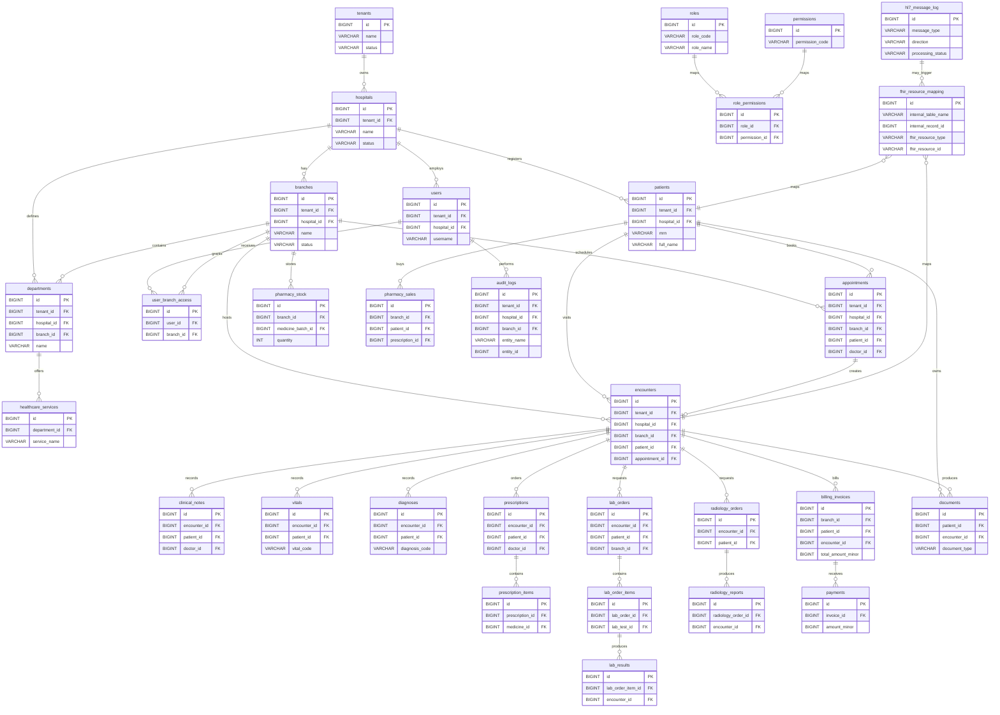

### Relationship Explanation

- Tenant owns hospitals; hospitals own branches and register patients.
- Patient is hospital-level; appointment and encounter are branch-level.
- Encounter is the clinical anchor for vitals, diagnosis, notes, prescriptions, lab, radiology and billing.
- FHIR mapping connects internal records to FHIR resource identifiers.
- HL7 message log stores inbound/outbound integration messages and may create or update internal mapped records.

### FHIR Mapping Summary

- Patient -> Patient
- Encounter -> Encounter
- Vitals/Lab results -> Observation
- Prescription -> MedicationRequest
- Billing invoice/items -> Account/ChargeItem
- Documents -> DocumentReference
- Audit -> AuditEvent

### Tenant / Hospital / Branch Scope

- Hospital-level: patients, departments, users.
- Branch-level: appointments, encounters, lab orders, pharmacy stock, billing invoices.
- Encounter-level: vitals, diagnoses, notes, prescriptions, lab/radiology orders.

### Key Indexes Required

- `idx_patients_tenant_hospital_mrn on patients(tenant_id, hospital_id, mrn)`
- `idx_encounters_branch_patient on encounters(tenant_id, hospital_id, branch_id, patient_id)`
- `idx_billing_branch_date on billing_invoices(tenant_id, hospital_id, branch_id, invoice_date)`

### Developer Notes

- Do not build module tables before foundation tables exist.
- Never query clinical or billing data without tenant and branch filters.
- Do not duplicate patient or encounter concepts in other modules.

## 2. Tenant, Hospital, Branch, User and RBAC ERD

Defines SaaS hierarchy, branch access and role-permission model.

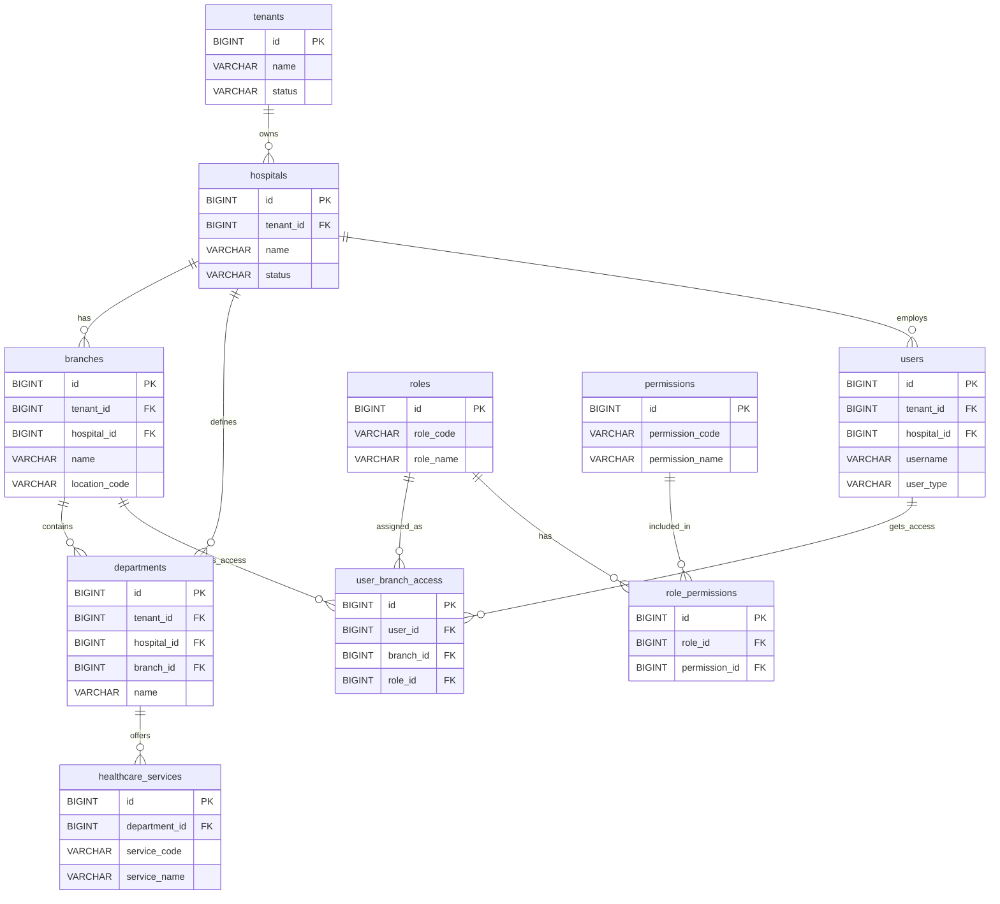

### Relationship Explanation

- User can access multiple branches through user_branch_access.
- Role has many permissions through role_permissions.
- Hospital has many branches; branch may have departments and services.

### FHIR Mapping Summary

- Hospital/Tenant -> Organization
- Branch -> Location
- Department/Service -> HealthcareService
- User -> Practitioner
- user_branch_access -> PractitionerRole

### Tenant / Hospital / Branch Scope

- Foundation tables are tenant/hospital scoped.
- branches are branch scope roots.
- user_branch_access controls branch-level authorization.

### Key Indexes Required

- `idx_branches_hospital on branches(tenant_id, hospital_id)`
- `idx_user_branch_access_user on user_branch_access(user_id, branch_id)`
- `idx_role_permissions_role on role_permissions(role_id, permission_id)`

### Developer Notes

- Backend must derive allowed branch IDs from token/user_branch_access.
- Do not trust frontend branch selector for authorization.

## 3. Patient Registration / MPI ERD

Defines hospital-level patient identity and related demographic, consent, insurance and access records.

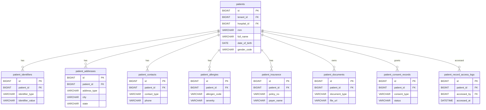

### Relationship Explanation

- Patients own identifiers, addresses, contacts, allergies, insurance, documents, consent and access logs.
- Patient is hospital-level by default, so branch activity starts with appointment/encounter.

### FHIR Mapping Summary

- patients -> Patient
- patient_identifiers -> Patient.identifier
- patient_addresses -> Patient.address
- patient_contacts -> Patient.contact / RelatedPerson
- patient_allergies -> AllergyIntolerance
- patient_documents -> DocumentReference
- patient_consent_records -> Consent

### Tenant / Hospital / Branch Scope

- Hospital-level: patients and demographic tables use tenant_id + hospital_id.
- Access logs may include branch_id when access happens from a branch context.

### Key Indexes Required

- `idx_patients_tenant_hospital_mrn on patients(tenant_id, hospital_id, mrn)`
- `idx_patient_identifiers_value on patient_identifiers(identifier_type, identifier_value)`
- `idx_patient_access_patient_date on patient_record_access_logs(patient_id, accessed_at)`

### Developer Notes

- Do not create separate patient tables for OPD/IPD/lab/pharmacy.
- Duplicate detection should use MRN, mobile, DOB and identifiers.

## 4. Appointment and Encounter ERD

Shows scheduling, appointment lifecycle and conversion to encounter.

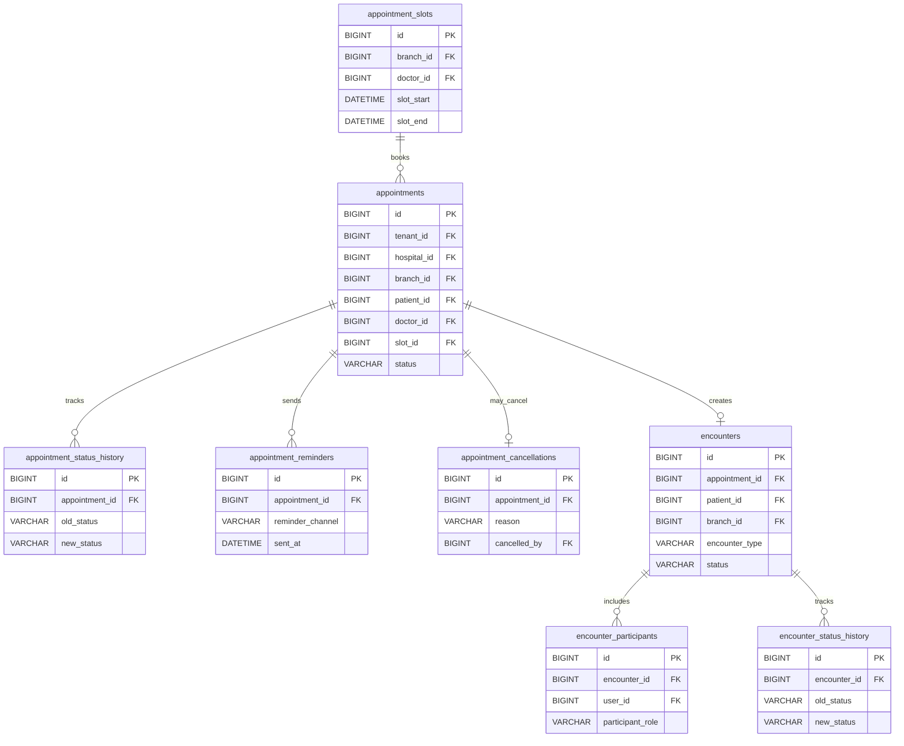

### Relationship Explanation

- Appointments are branch-level scheduling records.
- Appointment may create exactly one encounter, but walk-in encounters can exist without appointment.
- Encounter participants store doctor/nurse/staff involvement.

### FHIR Mapping Summary

- appointments -> Appointment
- encounters -> Encounter
- participants -> Patient / Practitioner / Location through Encounter.participant

### Tenant / Hospital / Branch Scope

- Branch-level: appointments and encounters require tenant_id + hospital_id + branch_id.
- Encounter-level children must carry patient_id and encounter_id.

### Key Indexes Required

- `idx_appointments_branch_date on appointments(tenant_id, hospital_id, branch_id, appointment_date, status)`
- `idx_encounters_patient_branch on encounters(tenant_id, hospital_id, branch_id, patient_id)`

### Developer Notes

- Use status history tables instead of overwriting lifecycle trace.
- Appointment cancellation should not hard delete appointment.

## 5. Clinical EMR ERD

Defines encounter-centric clinical documentation and observation model.

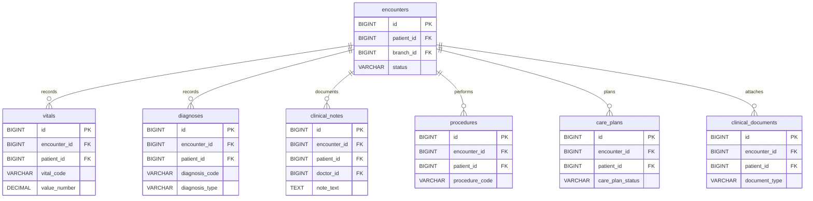

### Relationship Explanation

- All clinical records are children of encounters.
- Clinical records should not float only under patient without encounter unless explicitly marked longitudinal.

### FHIR Mapping Summary

- vitals -> Observation
- diagnoses -> Condition
- procedures -> Procedure
- care_plans -> CarePlan
- clinical_documents -> DocumentReference

### Tenant / Hospital / Branch Scope

- Encounter-level: tenant_id + hospital_id + branch_id + patient_id + encounter_id.

### Key Indexes Required

- `idx_vitals_encounter_time on vitals(encounter_id, created_at)`
- `idx_diagnoses_patient_code on diagnoses(patient_id, diagnosis_code)`
- `idx_clinical_notes_encounter on clinical_notes(encounter_id, created_at)`

### Developer Notes

- Clinical note edits should create audit trail or document version.
- Use controlled code systems for diagnosis/procedure where possible.

## 6. Prescription and Pharmacy Dispensing ERD

Connects prescriptions, medicine catalog, branch stock, dispensing and sales.

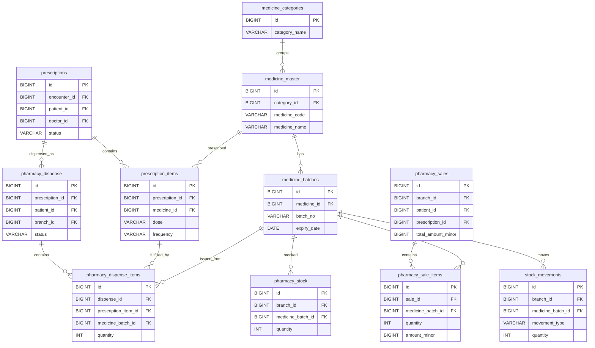

### Relationship Explanation

- Prescription creates medication request; dispense fulfills prescription items.
- Medicine batch drives stock, sale and dispense traceability.
- Stock movement must be written for every stock change.

### FHIR Mapping Summary

- prescriptions -> MedicationRequest
- medicine_master -> Medication
- pharmacy_dispense -> MedicationDispense
- IPD medication administration -> MedicationAdministration when used.

### Tenant / Hospital / Branch Scope

- medicine_master can be hospital-level.
- pharmacy_stock, sales and dispense are branch-level.

### Key Indexes Required

- `idx_pharmacy_stock_branch_batch on pharmacy_stock(branch_id, medicine_batch_id)`
- `idx_batches_expiry on medicine_batches(medicine_id, expiry_date)`
- `idx_stock_movements_branch_date on stock_movements(branch_id, created_at)`

### Developer Notes

- Money uses BIGINT minor units, never FLOAT/DOUBLE.
- Do not update stock without stock_movements entry.

## 7. Lab / Diagnostics ERD

Shows lab catalog, order, sample, result, parameters and diagnostic report.

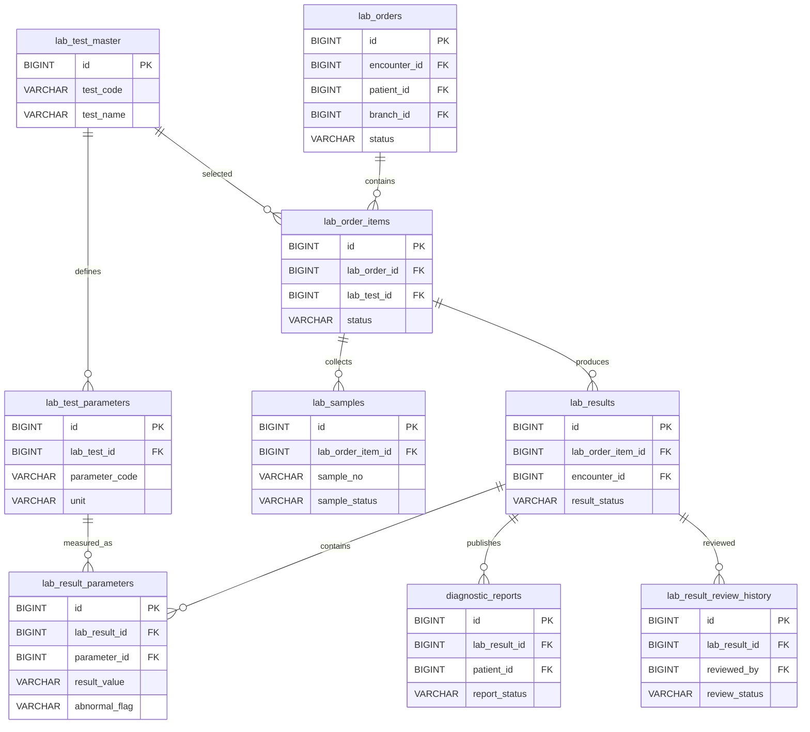

### Relationship Explanation

- Lab order belongs to encounter and branch.
- Lab order items represent tests; parameters define expected result values.
- Diagnostic report is generated from reviewed results.

### FHIR Mapping Summary

- lab_orders -> ServiceRequest
- lab_samples -> Specimen
- lab_results/result parameters -> Observation
- diagnostic_reports -> DiagnosticReport

### Tenant / Hospital / Branch Scope

- lab_orders, samples, results and reports are branch and encounter-level.

### Key Indexes Required

- `idx_lab_orders_branch_status on lab_orders(tenant_id, hospital_id, branch_id, status, created_at)`
- `idx_lab_results_order_item on lab_results(lab_order_item_id, result_status)`
- `idx_lab_samples_sample_no on lab_samples(sample_no)`

### Developer Notes

- Do not store final report only as PDF; keep structured result rows.
- Critical values should trigger audit/notification workflow.

## 8. Radiology ERD

Shows radiology order, order items, reports, imaging studies and review history.

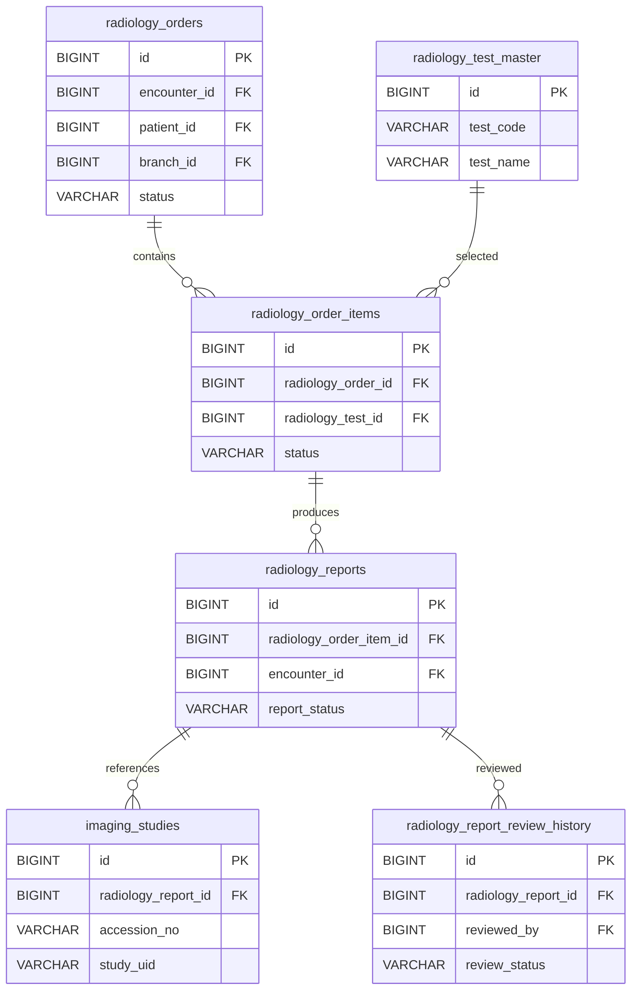

### Relationship Explanation

- Radiology order belongs to encounter and branch.
- Radiology reports are generated from order items and may link imaging studies.

### FHIR Mapping Summary

- radiology_orders -> ServiceRequest
- radiology_reports -> DiagnosticReport
- imaging_studies -> ImagingStudy
- report documents -> DocumentReference

### Tenant / Hospital / Branch Scope

- Radiology orders and reports are branch-level and encounter-level.

### Key Indexes Required

- `idx_radiology_orders_branch_status on radiology_orders(tenant_id, hospital_id, branch_id, status, created_at)`
- `idx_imaging_study_uid on imaging_studies(study_uid)`

### Developer Notes

- Keep DICOM/image references separate from report text.
- Report review should be tracked in history table.

## 9. Billing, Payment and Insurance ERD

Shows invoices, invoice items, payments, allocations, refunds and claims.

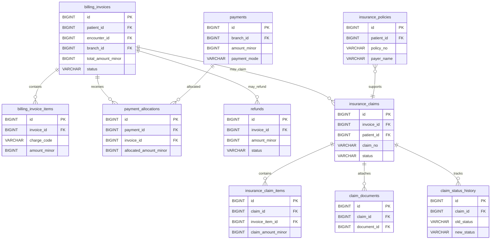

### Relationship Explanation

- Invoice belongs to patient, encounter and branch.
- Payments can be allocated to one or more invoices using payment_allocations.
- Claims are linked to invoices and claim items map to invoice items.

### FHIR Mapping Summary

- billing account -> Account
- invoice item/charges -> ChargeItem
- insurance claim -> Claim
- claim/payment explanation -> ExplanationOfBenefit

### Tenant / Hospital / Branch Scope

- Billing, payments, refunds and claims are branch-level financial transactions.

### Key Indexes Required

- `idx_invoices_branch_date on billing_invoices(tenant_id, hospital_id, branch_id, invoice_date, status)`
- `idx_payment_allocations_invoice on payment_allocations(invoice_id, payment_id)`
- `idx_claims_invoice_status on insurance_claims(invoice_id, status)`

### Developer Notes

- Money columns use BIGINT minor units.
- Do not cascade delete invoices or payment records.

## 10. IPD, Ward, Room and Bed ERD

Defines admission, bed hierarchy, nursing and discharge relationships.

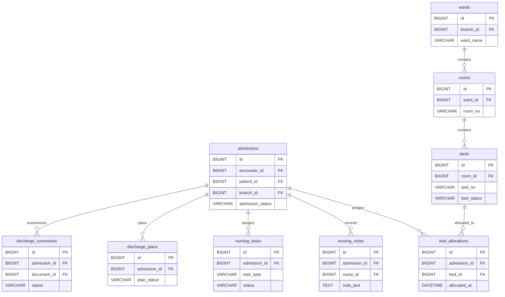

### Relationship Explanation

- Encounter may create admission.
- Branch has wards; wards have rooms; rooms have beds.
- Admission can have multiple bed allocations over time.

### FHIR Mapping Summary

- admission/visit -> Encounter
- ward/room/bed -> Location
- nursing notes/discharge summary -> DocumentReference
- discharge summary -> Composition + DocumentReference

### Tenant / Hospital / Branch Scope

- IPD tables are branch-level and admission/encounter-level.

### Key Indexes Required

- `idx_admissions_branch_status on admissions(branch_id, admission_status)`
- `idx_bed_allocations_admission on bed_allocations(admission_id, allocated_at)`
- `idx_beds_room_status on beds(room_id, bed_status)`

### Developer Notes

- Bed allocation history must be retained.
- Do not overwrite discharge summaries without version/audit.

## 11. Surgery / OT ERD

Shows operation theatre, surgery case, team, checklists, anesthesia and notes.

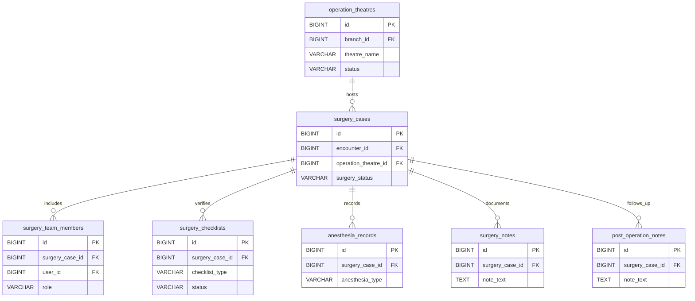

### Relationship Explanation

- Surgery case belongs to encounter and operation theatre.
- Team, checklist, anesthesia and notes belong to surgery case.

### FHIR Mapping Summary

- surgery_cases -> Procedure
- operation_theatres -> Location
- anesthesia_records -> Observation
- surgery_notes -> DocumentReference

### Tenant / Hospital / Branch Scope

- Surgery and OT tables are branch-level and encounter-level.

### Key Indexes Required

- `idx_surgery_cases_encounter on surgery_cases(encounter_id, surgery_status)`
- `idx_ot_branch_status on operation_theatres(branch_id, status)`

### Developer Notes

- Surgery checklist should be auditable.
- OT booking conflicts should be prevented at service layer and indexed by theatre/time.

## 12. Documents and Audit ERD

Defines document versioning, access logs, audit logs, consent and break-glass tracking.

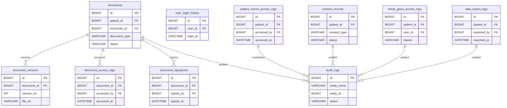

### Relationship Explanation

- Documents support versioning, access logs and signatures.
- Audit records are created for critical access and changes.
- Break-glass access is tracked separately.

### FHIR Mapping Summary

- documents -> DocumentReference
- audit_logs -> AuditEvent
- consent_records -> Consent
- change tracking -> Provenance

### Tenant / Hospital / Branch Scope

- Documents can be patient-level or encounter-level.
- Audit logs include tenant_id/hospital_id/branch_id where applicable.

### Key Indexes Required

- `idx_documents_patient_encounter on documents(patient_id, encounter_id)`
- `idx_audit_entity on audit_logs(entity_name, entity_id)`
- `idx_patient_access_logs on patient_record_access_logs(patient_id, accessed_at)`

### Developer Notes

- Do not delete audit logs in normal application flow.
- Document signatures should be immutable after signing.

## 13. FHIR Mapping ERD

Defines FHIR resource mapping, resource store, API audit, sync and terminology mapping.

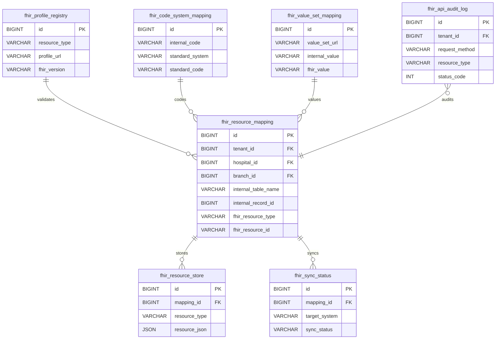

### Relationship Explanation

- FHIR mapping connects internal table name + internal record ID to FHIR resource type + resource ID.
- FHIR store can hold generated JSON if needed.
- API audit logs every external FHIR API request.

### FHIR Mapping Summary

- Supports Patient, Encounter, Observation, Condition, ServiceRequest, DiagnosticReport, MedicationRequest, MedicationDispense, Account, Claim, DocumentReference, AuditEvent and more.

### Tenant / Hospital / Branch Scope

- FHIR mapping includes tenant_id/hospital_id and branch_id where relevant.

### Key Indexes Required

- `idx_fhir_internal_record on fhir_resource_mapping(internal_table_name, internal_record_id)`
- `idx_fhir_resource_id on fhir_resource_mapping(fhir_resource_type, fhir_resource_id)`
- `idx_fhir_sync_status on fhir_sync_status(mapping_id, target_system, sync_status)`

### Developer Notes

- FHIR tables are not source of truth; normalized HMS tables are source of truth.
- Terminology mapping should be reviewed by integration/clinical standards team.

## 14. HL7 Integration ERD

Defines inbound/outbound HL7 message logging and external identifier mapping.

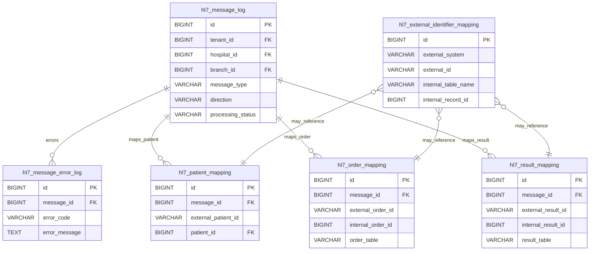

### Relationship Explanation

- HL7 message log stores inbound/outbound ADT, ORM, ORU, SIU, DFT and MDM messages.
- Mapping tables connect external patient/order/result IDs to internal records.
- Error log belongs to message log.

### FHIR Mapping Summary

- HL7 is not FHIR, but HL7 events can create/update internal records that later map to FHIR resources.

### Tenant / Hospital / Branch Scope

- HL7 tables include tenant/hospital/branch context when known from message routing.

### Key Indexes Required

- `idx_hl7_message_type_status on hl7_message_log(message_type, direction, processing_status)`
- `idx_hl7_external_identifier on hl7_external_identifier_mapping(external_system, external_id)`
- `idx_hl7_patient_mapping on hl7_patient_mapping(external_patient_id, patient_id)`

### Developer Notes

- Never drop raw message logs without retention policy.
- Message replay should be idempotent using message control ID.

## 15. Reporting / Analytics ERD

Defines denormalized summaries used by dashboards, reports and AI command center.

```mermaid
erDiagram
    daily_branch_revenue_summary {
        BIGINT id PK
        BIGINT tenant_id FK
        BIGINT hospital_id FK
        BIGINT branch_id FK
        DATE summary_date
        BIGINT revenue_amount_minor
    }
    daily_patient_visit_summary {
        BIGINT id PK
        BIGINT tenant_id FK
        BIGINT hospital_id FK
        BIGINT branch_id FK
        DATE summary_date
        INT visit_count
    }
    doctor_performance_summary {
        BIGINT id PK
        BIGINT doctor_id FK
        DATE summary_date
        INT encounter_count
    }
    department_collection_summary {
        BIGINT id PK
        BIGINT department_id FK
        DATE summary_date
        BIGINT collection_amount_minor
    }
    lab_test_volume_summary {
        BIGINT id PK
        BIGINT branch_id FK
        DATE summary_date
        INT test_count
    }
    pharmacy_stock_snapshot {
        BIGINT id PK
        BIGINT branch_id FK
        BIGINT medicine_id FK
        DATE snapshot_date
        INT quantity
    }
    bed_occupancy_summary {
        BIGINT id PK
        BIGINT branch_id FK
        DATE summary_date
        INT occupied_beds
    }
    patient_journey_summary {
        BIGINT id PK
        BIGINT patient_id FK
        BIGINT encounter_id FK
        VARCHAR current_stage
        VARCHAR risk_level
    }

    daily_branch_revenue_summary }o--|| billing_invoices : generated_from
    daily_patient_visit_summary }o--|| encounters : generated_from
    doctor_performance_summary }o--|| encounters : generated_from
    department_collection_summary }o--|| billing_invoice_items : generated_from
    lab_test_volume_summary }o--|| lab_orders : generated_from
    pharmacy_stock_snapshot }o--|| pharmacy_stock : generated_from
    bed_occupancy_summary }o--|| bed_allocations : generated_from
    patient_journey_summary }o--|| encounters : generated_from
```

### Relationship Explanation

- Reporting tables are generated from transactional source tables.
- They are not source of truth.
- They are used for dashboards, reports and AI command center.

### FHIR Mapping Summary

- Reporting tables usually do not map directly to FHIR resources.

### Tenant / Hospital / Branch Scope

- Summary tables must retain tenant_id/hospital_id/branch_id according to reporting level.

### Key Indexes Required

- `idx_daily_revenue_branch_date on daily_branch_revenue_summary(branch_id, summary_date)`
- `idx_visit_summary_branch_date on daily_patient_visit_summary(branch_id, summary_date)`
- `idx_patient_journey_encounter on patient_journey_summary(patient_id, encounter_id)`

### Developer Notes

- Do not write business transactions directly into summary tables.
- Refresh summaries through scheduled jobs or events.

## A. Table Relationship Matrix

| Parent Table | Child Table | Relationship | Parent Key | Child Foreign Key | Module | FHIR Resource | Notes |
| --- | --- | --- | --- | --- | --- | --- | --- |
| tenants | hospitals | 1:N | tenants.id | hospitals.tenant_id | Foundation | Organization | Tenant owns hospitals. |
| hospitals | branches | 1:N | hospitals.id | branches.hospital_id | Foundation | Location | Hospital has branches. |
| hospitals | patients | 1:N | hospitals.id | patients.hospital_id | Patient | Patient | Patient is hospital-level. |
| branches | appointments | 1:N | branches.id | appointments.branch_id | Appointment | Appointment | Appointment is branch-level. |
| patients | appointments | 1:N | patients.id | appointments.patient_id | Appointment | Appointment | Patient books appointments. |
| appointments | encounters | 0/1:1 | appointments.id | encounters.appointment_id | Encounter | Encounter | Appointment may create encounter. |
| patients | encounters | 1:N | patients.id | encounters.patient_id | Encounter | Encounter | Patient has visits. |
| branches | encounters | 1:N | branches.id | encounters.branch_id | Encounter | Encounter | Encounter is branch-level. |
| encounters | vitals | 1:N | encounters.id | vitals.encounter_id | Clinical | Observation | Vitals are encounter observations. |
| encounters | diagnoses | 1:N | encounters.id | diagnoses.encounter_id | Clinical | Condition | Diagnosis belongs to encounter. |
| encounters | clinical_notes | 1:N | encounters.id | clinical_notes.encounter_id | Clinical | DocumentReference | Notes belong to encounter. |
| encounters | prescriptions | 1:N | encounters.id | prescriptions.encounter_id | Prescription | MedicationRequest | Medication orders. |
| prescriptions | prescription_items | 1:N | prescriptions.id | prescription_items.prescription_id | Prescription | MedicationRequest | Prescription items. |
| medicine_master | prescription_items | 1:N | medicine_master.id | prescription_items.medicine_id | Prescription | Medication | Medicine selected in prescription. |
| encounters | lab_orders | 1:N | encounters.id | lab_orders.encounter_id | Lab | ServiceRequest | Encounter requests lab. |
| lab_orders | lab_order_items | 1:N | lab_orders.id | lab_order_items.lab_order_id | Lab | ServiceRequest | Lab order has tests. |
| lab_order_items | lab_results | 1:N | lab_order_items.id | lab_results.lab_order_item_id | Lab | Observation | Test item produces results. |
| encounters | radiology_orders | 1:N | encounters.id | radiology_orders.encounter_id | Radiology | ServiceRequest | Encounter requests imaging. |
| radiology_orders | radiology_reports | 1:N | radiology_orders.id | radiology_reports.radiology_order_id | Radiology | DiagnosticReport | Imaging order produces report. |
| medicine_master | medicine_batches | 1:N | medicine_master.id | medicine_batches.medicine_id | Pharmacy | Medication | Medicine has batches. |
| medicine_batches | pharmacy_stock | 1:N | medicine_batches.id | pharmacy_stock.medicine_batch_id | Pharmacy | Internal | Batch stock per branch. |
| pharmacy_sales | pharmacy_sale_items | 1:N | pharmacy_sales.id | pharmacy_sale_items.sale_id | Pharmacy | MedicationDispense | Sale has line items. |
| encounters | billing_invoices | 1:N | encounters.id | billing_invoices.encounter_id | Billing | Account | Encounter generates invoices. |
| billing_invoices | billing_invoice_items | 1:N | billing_invoices.id | billing_invoice_items.invoice_id | Billing | ChargeItem | Invoice has charges. |
| billing_invoices | payment_allocations | 1:N | billing_invoices.id | payment_allocations.invoice_id | Billing | ExplanationOfBenefit | Payment allocated to invoice. |
| payments | payment_allocations | 1:N | payments.id | payment_allocations.payment_id | Billing | PaymentReconciliation | One payment covers invoices. |
| encounters | admissions | 0/1:N | encounters.id | admissions.encounter_id | IPD | Encounter | Encounter may create admission. |
| wards | rooms | 1:N | wards.id | rooms.ward_id | IPD | Location | Ward has rooms. |
| rooms | beds | 1:N | rooms.id | beds.room_id | IPD | Location | Room has beds. |
| admissions | bed_allocations | 1:N | admissions.id | bed_allocations.admission_id | IPD | Encounter.location | Admission has bed history. |
| operation_theatres | surgery_cases | 1:N | operation_theatres.id | surgery_cases.operation_theatre_id | Surgery | Location/Procedure | OT hosts surgery. |
| surgery_cases | surgery_team_members | 1:N | surgery_cases.id | surgery_team_members.surgery_case_id | Surgery | PractitionerRole | Surgery team. |
| patients | documents | 1:N | patients.id | documents.patient_id | Documents | DocumentReference | Patient documents. |
| encounters | documents | 1:N | encounters.id | documents.encounter_id | Documents | DocumentReference | Encounter documents. |
| documents | document_versions | 1:N | documents.id | document_versions.document_id | Documents | DocumentReference | Version history. |
| documents | document_access_logs | 1:N | documents.id | document_access_logs.document_id | Audit | AuditEvent | Document access. |
| patients | patient_record_access_logs | 1:N | patients.id | patient_record_access_logs.patient_id | Audit | AuditEvent | Patient access logs. |
| fhir_resource_mapping | fhir_resource_store | 1:N | fhir_resource_mapping.id | fhir_resource_store.mapping_id | FHIR | All | FHIR JSON store. |
| hl7_message_log | hl7_message_error_log | 1:N | hl7_message_log.id | hl7_message_error_log.message_id | HL7 | HL7 v2 | HL7 errors. |

## B. Module-Wise Table Ownership Matrix

| Module | Tables | Owner Team | Shared Dependencies | FHIR Mapping | Review Required |
| --- | --- | --- | --- | --- | --- |
| Foundation/RBAC | tenants, hospitals, branches, departments, healthcare_services, users, roles, permissions, role_permissions, user_branch_access | Foundation Team | None | Organization, Location, PractitionerRole | Database Architect |
| Patient/MPI | patients, identifiers, addresses, contacts, allergies, insurance, documents, consent | Patient Team | hospitals, users | Patient, AllergyIntolerance, Consent | FHIR Team |
| Appointment/Encounter | appointments, slots, status history, encounters, participants | Front Office + Clinical Team | patients, users, branches | Appointment, Encounter | Patient + FHIR Team |
| Clinical EMR | vitals, diagnoses, notes, procedures, care_plans, clinical_documents | Clinical Team | encounters, patients, users | Observation, Condition, Procedure, CarePlan | FHIR Team |
| Prescription/Pharmacy | prescriptions, prescription_items, medicine_master, batches, stock, dispense, sales, movements | Pharmacy Team | encounters, billing, branches | MedicationRequest, Medication, MedicationDispense | Clinical + Billing |
| Lab/Radiology | lab/radiology orders, items, samples, results, reports, imaging | Diagnostics Team | encounters, patients, billing | ServiceRequest, Observation, DiagnosticReport | FHIR/HL7 Team |
| Billing/Insurance | invoices, invoice_items, payments, allocations, refunds, policies, claims | Billing Team | patients, encounters, services | Account, ChargeItem, Claim | Finance + Architect |
| IPD/Surgery | admissions, wards, rooms, beds, nursing, discharge, surgery, OT | IPD/Surgery Team | encounters, branches, billing | Encounter, Location, Procedure | Clinical + Billing |
| Documents/Audit | documents, versions, access logs, signatures, audit logs, consent, break glass | Compliance Team | patients, encounters, users | DocumentReference, AuditEvent, Consent | Security + Compliance |
| FHIR/HL7 | fhir_resource_mapping, fhir_store, fhir_audit, hl7_message_log, mapping tables | Integration Team | all modules | All mapped resources | Architect + Module Owners |
| Reporting/Analytics | daily summaries, snapshots, patient_journey_summary | Reporting Team | transaction tables | N/A | Architect + Module Owners |

## C. Foreign Key Rule Matrix

| Table | FK Column | References Table | Cascade Rule | Index Required | Reason |
| --- | --- | --- | --- | --- | --- |
| hospitals | tenant_id | tenants.id | NO CASCADE DELETE | Yes | Tenant owns hospital; deletion should be controlled. |
| branches | hospital_id | hospitals.id | NO CASCADE DELETE | Yes | Branch records are operationally critical. |
| patients | hospital_id | hospitals.id | NO CASCADE DELETE | Yes | Patient records must not be cascade deleted. |
| appointments | patient_id | patients.id | NO CASCADE DELETE | Yes | Appointments belong to patient. |
| appointments | branch_id | branches.id | NO CASCADE DELETE | Yes | Appointments are branch-level. |
| encounters | patient_id | patients.id | NO CASCADE DELETE | Yes | Encounter is patient clinical record. |
| encounters | branch_id | branches.id | NO CASCADE DELETE | Yes | Encounter is branch-level. |
| vitals | encounter_id | encounters.id | NO CASCADE DELETE | Yes | Clinical record must be retained. |
| diagnoses | encounter_id | encounters.id | NO CASCADE DELETE | Yes | Clinical record must be retained. |
| prescriptions | encounter_id | encounters.id | NO CASCADE DELETE | Yes | Medication order traceability. |
| lab_orders | encounter_id | encounters.id | NO CASCADE DELETE | Yes | Diagnostic order traceability. |
| billing_invoices | encounter_id | encounters.id | NO CASCADE DELETE | Yes | Financial audit. |
| payments | branch_id | branches.id | NO CASCADE DELETE | Yes | Financial transaction scope. |
| documents | patient_id | patients.id | NO CASCADE DELETE | Yes | Document traceability. |
| audit_logs | performed_by | users.id | NO CASCADE DELETE | Yes | Audit must survive user deactivation. |

## D. Index Recommendation Table

| Table | Index Name | Columns | Purpose |
| --- | --- | --- | --- |
| patients | idx_patients_tenant_hospital_mrn | tenant_id, hospital_id, mrn | Fast MRN lookup under hospital. |
| patient_identifiers | idx_patient_identifiers_value | identifier_type, identifier_value | Patient search by external/government identifiers. |
| appointments | idx_appointments_branch_date_status | tenant_id, hospital_id, branch_id, appointment_date, status | Queue and schedule search. |
| encounters | idx_encounters_branch_patient | tenant_id, hospital_id, branch_id, patient_id | Patient visit lookup. |
| vitals | idx_vitals_encounter_time | encounter_id, created_at | Clinical timeline. |
| diagnoses | idx_diagnoses_patient_code | patient_id, diagnosis_code | Problem history. |
| lab_orders | idx_lab_orders_branch_status | tenant_id, hospital_id, branch_id, status, ordered_at | Lab queue. |
| lab_results | idx_lab_results_order_item | lab_order_item_id, result_status | Result lookup. |
| radiology_orders | idx_radiology_orders_branch_status | tenant_id, hospital_id, branch_id, status, ordered_at | Radiology queue. |
| pharmacy_stock | idx_pharmacy_stock_branch_batch | branch_id, medicine_batch_id | Stock lookup. |
| stock_movements | idx_stock_movements_branch_date | branch_id, created_at | Stock audit. |
| billing_invoices | idx_billing_invoices_branch_date | tenant_id, hospital_id, branch_id, invoice_date, status | Billing dashboard. |
| payment_allocations | idx_payment_allocations_invoice | invoice_id, payment_id | Payment allocation lookup. |
| documents | idx_documents_patient_encounter | patient_id, encounter_id | Document list. |
| audit_logs | idx_audit_entity | entity_name, entity_id, created_at | Audit lookup. |
| fhir_resource_mapping | idx_fhir_internal_record | internal_table_name, internal_record_id | Internal to FHIR mapping. |
| hl7_message_log | idx_hl7_message_type_status | message_type, direction, processing_status | HL7 processing queue. |

## E. ERD Validation Checklist

- No duplicate business entity tables.
- All tenant-scoped tables have tenant_id.
- All branch operations have branch_id.
- Patient connects to encounters.
- Encounter connects to clinical, lab, pharmacy and billing.
- FHIR mapping exists for healthcare data.
- HL7 message logging exists.
- Audit tables exist.
- Reporting tables are clearly denormalized.
- Migration naming follows Flyway timestamp convention.
- Money values use BIGINT minor units, not FLOAT/DOUBLE.
- No cascade delete on patient, encounter, clinical, billing or audit records.

## Final Recommendation

Create foundation and RBAC tables first. Create patient tables before appointment and encounter. Create encounter before clinical, diagnostics, prescription, pharmacy and billing. Create FHIR/HL7 integration tables after core transactional tables. Create denormalized reporting tables last.