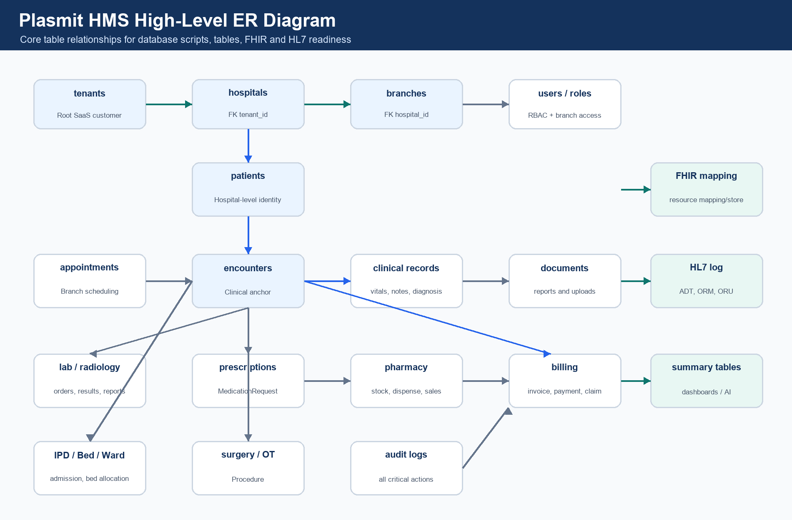

# Plasmit HMS ER Diagram - Database Scripts and Tables

## Purpose

This document gives a high-level ER diagram and table relationship plan for the Plasmit HMS database.

## Database

- Database name: `plasmit_hms`
- First table: `tenants`
- Migration tool: Flyway

## Script Order

| Order | Script Name | Main Tables |
| --- | --- | --- |
| 1 | V202606030001__create_foundation_tables.sql | tenants, hospitals, branches, departments, healthcare_services |
| 2 | V202606030002__create_user_role_permission_tables.sql | users, roles, permissions, role_permissions, user_branch_access |
| 3 | V202606030003__create_patient_tables.sql | patients, patient_identifiers, patient_addresses, patient_contacts, patient_allergies |
| 4 | V202606030004__create_appointment_tables.sql | appointment_slots, appointments, appointment_status_history, appointment_reminders |
| 5 | V202606030005__create_encounter_clinical_tables.sql | encounters, encounter_participants, vitals, diagnoses, clinical_notes, procedures, care_plans |
| 6 | V202606030006__create_prescription_medication_tables.sql | prescriptions, prescription_items, medication_administration_records |
| 7 | V202606030007__create_lab_radiology_tables.sql | lab_orders, lab_order_items, lab_samples, lab_results, diagnostic_reports, radiology_orders, radiology_reports |
| 8 | V202606030008__create_pharmacy_inventory_tables.sql | medicine_master, medicine_batches, pharmacy_stock, stock_movements, pharmacy_sales |
| 9 | V202606030009__create_billing_insurance_tables.sql | billing_invoices, billing_invoice_items, payments, refunds, insurance_claims |
| 10 | V202606030010__create_ipd_surgery_document_audit_tables.sql | admissions, wards, rooms, beds, surgery_cases, documents, audit_logs |
| 11 | V202606030011__create_fhir_hl7_tables.sql | fhir_resource_mapping, fhir_resource_store, hl7_message_log, hl7 mappings |
| 12 | V202606030012__create_reporting_summary_tables.sql | daily summaries, snapshots, patient_journey_summary |

## Mermaid ER Diagram

```mermaid
erDiagram
    tenants ||--o{ hospitals : owns
    hospitals ||--o{ branches : has
    hospitals ||--o{ departments : defines
    departments ||--o{ healthcare_services : offers
    hospitals ||--o{ users : employs
    users ||--o{ user_branch_access : receives
    branches ||--o{ user_branch_access : allows
    roles ||--o{ role_permissions : maps
    permissions ||--o{ role_permissions : maps
    hospitals ||--o{ patients : registers
    patients ||--o{ patient_identifiers : has
    patients ||--o{ patient_addresses : has
    patients ||--o{ patient_contacts : has
    patients ||--o{ patient_allergies : has
    patients ||--o{ appointments : books
    branches ||--o{ appointments : schedules
    users ||--o{ appointments : attends
    appointments ||--o| encounters : creates
    patients ||--o{ encounters : visits
    branches ||--o{ encounters : hosts
    encounters ||--o{ encounter_participants : includes
    users ||--o{ encounter_participants : participates
    encounters ||--o{ vitals : records
    encounters ||--o{ diagnoses : records
    encounters ||--o{ clinical_notes : records
    encounters ||--o{ procedures : performs
    encounters ||--o{ care_plans : plans
    encounters ||--o{ prescriptions : orders
    prescriptions ||--o{ prescription_items : contains
    medicine_master ||--o{ prescription_items : references
    encounters ||--o{ lab_orders : requests
    lab_orders ||--o{ lab_order_items : contains
    lab_test_master ||--o{ lab_order_items : selected
    lab_order_items ||--o{ lab_samples : collects
    lab_order_items ||--o{ lab_results : produces
    lab_results ||--o{ lab_result_parameters : contains
    lab_results ||--o{ diagnostic_reports : publishes
    encounters ||--o{ radiology_orders : requests
    radiology_orders ||--o{ radiology_order_items : contains
    radiology_order_items ||--o{ radiology_reports : produces
    radiology_reports ||--o{ imaging_studies : references
    medicine_master ||--o{ medicine_batches : has
    medicine_batches ||--o{ pharmacy_stock : stocked_as
    branches ||--o{ pharmacy_stock : owns
    pharmacy_sales ||--o{ pharmacy_sale_items : contains
    medicine_batches ||--o{ pharmacy_sale_items : issued_from
    encounters ||--o{ billing_invoices : bills
    billing_invoices ||--o{ billing_invoice_items : contains
    billing_invoices ||--o{ payment_allocations : receives
    payments ||--o{ payment_allocations : allocates
    patients ||--o{ insurance_policies : has
    billing_invoices ||--o{ insurance_claims : claims
    insurance_claims ||--o{ insurance_claim_items : contains
    encounters ||--o{ admissions : admits
    branches ||--o{ wards : has
    wards ||--o{ rooms : contains
    rooms ||--o{ beds : contains
    admissions ||--o{ bed_allocations : assigns
    admissions ||--o{ nursing_notes : records
    admissions ||--o{ discharge_summaries : generates
    branches ||--o{ operation_theatres : has
    encounters ||--o{ surgery_cases : schedules
    surgery_cases ||--o{ surgery_team_members : includes
    surgery_cases ||--o{ surgery_checklists : checks
    patients ||--o{ documents : owns
    encounters ||--o{ documents : produces
    documents ||--o{ document_versions : versions
    documents ||--o{ document_access_logs : audits
    users ||--o{ audit_logs : performs
    patients ||--o{ patient_record_access_logs : accessed
    patients ||--o{ consent_records : consents
    fhir_resource_mapping }o--|| patients : maps
    fhir_resource_mapping }o--|| encounters : maps
    hl7_message_log ||--o{ hl7_patient_mapping : maps
    hl7_message_log ||--o{ hl7_order_mapping : maps
    hl7_message_log ||--o{ hl7_result_mapping : maps
```

## Module-Wise Table Catalog

| Module | Tables | Purpose |
| --- | --- | --- |
| Foundation | tenants, hospitals, branches, departments, healthcare_services | Tenant -> Hospital -> Branch -> Service hierarchy |
| Access Control | users, roles, permissions, role_permissions, user_branch_access | Login, RBAC and branch access |
| Patient | patients, patient_identifiers, patient_addresses, patient_contacts, patient_allergies, patient_insurance, patient_documents, patient_consent_records | Hospital-level patient record |
| Appointment | appointment_slots, appointments, appointment_status_history, appointment_reminders, appointment_cancellations | Branch-level scheduling |
| Encounter / Clinical | encounters, encounter_participants, encounter_status_history, vitals, diagnoses, clinical_notes, clinical_documents, procedures, care_plans | Clinical source of truth |
| Prescription / Medication | prescriptions, prescription_items, medicine_master, medication_instructions, medication_administration_records | Medication orders and administration |
| Lab / Diagnostics | lab_test_master, lab_test_parameters, lab_orders, lab_order_items, lab_samples, lab_results, lab_result_parameters, diagnostic_reports | Order to result workflow |
| Radiology | radiology_test_master, radiology_orders, radiology_order_items, radiology_reports, imaging_studies | Imaging order to report workflow |
| Pharmacy / Inventory | medicine_categories, medicine_batches, pharmacy_stock, stock_movements, pharmacy_sales, pharmacy_sale_items, pharmacy_returns, purchase_orders, goods_receipts | Stock, dispensing and procurement |
| Billing / Insurance | billing_invoices, billing_invoice_items, payments, payment_allocations, refunds, insurance_policies, insurance_claims, insurance_claim_items | Revenue cycle |
| IPD / Nursing / Bed | admissions, wards, rooms, beds, bed_allocations, nursing_notes, nursing_tasks, discharge_plans, discharge_summaries | Admission and bed management |
| Surgery / OT | operation_theatres, surgery_cases, surgery_team_members, surgery_checklists, anesthesia_records, surgery_notes | Operation theatre workflow |
| Documents | documents, document_versions, document_access_logs, document_signatures | Reports, uploads and signed documents |
| Audit / Compliance | audit_logs, user_login_history, patient_record_access_logs, consent_records, break_glass_access_logs, data_export_logs | Compliance and access traceability |
| FHIR Integration | fhir_resource_mapping, fhir_resource_store, fhir_api_audit_log, fhir_sync_status, fhir_profile_registry, fhir_code_system_mapping | FHIR resource mapping and API audit |
| HL7 Integration | hl7_message_log, hl7_message_error_log, hl7_external_identifier_mapping, hl7_patient_mapping, hl7_order_mapping, hl7_result_mapping | HL7 inbound/outbound mapping |
| Reporting | daily_branch_revenue_summary, daily_patient_visit_summary, doctor_performance_summary, department_collection_summary, lab_test_volume_summary, pharmacy_stock_snapshot, bed_occupancy_summary, patient_journey_summary | Dashboards and AI command center |

## Main Table Relationships

| Parent Table | Child Table | Relationship | Join Key | Business Meaning |
| --- | --- | --- | --- | --- |
| tenants | hospitals | 1:N | hospitals.tenant_id | One tenant/hospital group owns many hospitals. |
| hospitals | branches | 1:N | branches.hospital_id | One hospital has many branches/facilities. |
| hospitals | patients | 1:N | patients.hospital_id | Patient is hospital-level by default. |
| branches | appointments | 1:N | appointments.branch_id | Appointments are branch-level. |
| patients | appointments | 1:N | appointments.patient_id | One patient can book many appointments. |
| patients | encounters | 1:N | encounters.patient_id | One patient can have many visits. |
| branches | encounters | 1:N | encounters.branch_id | Encounter is branch-level. |
| appointments | encounters | 0/1:1 | encounters.appointment_id | Appointment may create encounter. |
| encounters | vitals | 1:N | vitals.encounter_id | Vitals belong to encounter. |
| encounters | diagnoses | 1:N | diagnoses.encounter_id | Diagnosis belongs to encounter. |
| encounters | clinical_notes | 1:N | clinical_notes.encounter_id | Clinical notes belong to encounter. |
| encounters | prescriptions | 1:N | prescriptions.encounter_id | Prescription belongs to encounter. |
| prescriptions | prescription_items | 1:N | prescription_items.prescription_id | Prescription has many medicine lines. |
| encounters | lab_orders | 1:N | lab_orders.encounter_id | Lab order belongs to encounter. |
| lab_orders | lab_order_items | 1:N | lab_order_items.lab_order_id | Lab order has many tests. |
| lab_order_items | lab_results | 1:N | lab_results.lab_order_item_id | Test item creates results. |
| encounters | radiology_orders | 1:N | radiology_orders.encounter_id | Radiology order belongs to encounter. |
| radiology_order_items | radiology_reports | 1:N | radiology_reports.radiology_order_item_id | Radiology item creates report. |
| medicine_master | medicine_batches | 1:N | medicine_batches.medicine_id | Medicine has many batches. |
| medicine_batches | pharmacy_stock | 1:N | pharmacy_stock.medicine_batch_id | Batch stock is branch-wise. |
| pharmacy_sales | pharmacy_sale_items | 1:N | pharmacy_sale_items.sale_id | Sale has many items. |
| encounters | billing_invoices | 1:N | billing_invoices.encounter_id | Encounter may generate invoices. |
| billing_invoices | billing_invoice_items | 1:N | billing_invoice_items.invoice_id | Invoice has charge lines. |
| billing_invoices | payment_allocations | 1:N | payment_allocations.invoice_id | Payment is allocated to invoices. |
| payments | payment_allocations | 1:N | payment_allocations.payment_id | One payment may cover multiple invoices. |
| encounters | admissions | 0/1:N | admissions.encounter_id | IPD admission starts from encounter. |
| wards | rooms | 1:N | rooms.ward_id | Ward contains rooms. |
| rooms | beds | 1:N | beds.room_id | Room contains beds. |
| admissions | bed_allocations | 1:N | bed_allocations.admission_id | Admission can have multiple bed allocations. |
| encounters | surgery_cases | 1:N | surgery_cases.encounter_id | Surgery belongs to encounter. |
| patients | documents | 1:N | documents.patient_id | Documents are linked to patient. |
| encounters | documents | 1:N | documents.encounter_id | Documents may also link to encounter. |
| users | audit_logs | 1:N | audit_logs.performed_by | Every critical user action is audited. |
| internal tables | fhir_resource_mapping | 1:N | internal_table_name + internal_record_id | Internal records map to FHIR resources. |
| external systems | hl7_message_log | 1:N | message_control_id | Inbound/outbound HL7 messages are logged. |

## Final Recommendation

- Create `plasmit_hms` first.
- Create `tenants` first.
- Create foundation/access tables before patient/clinical tables.
- Keep patient hospital-level.
- Keep encounter branch-level.
- Create FHIR/HL7 tables after core tables.
- Create reporting summary tables last.