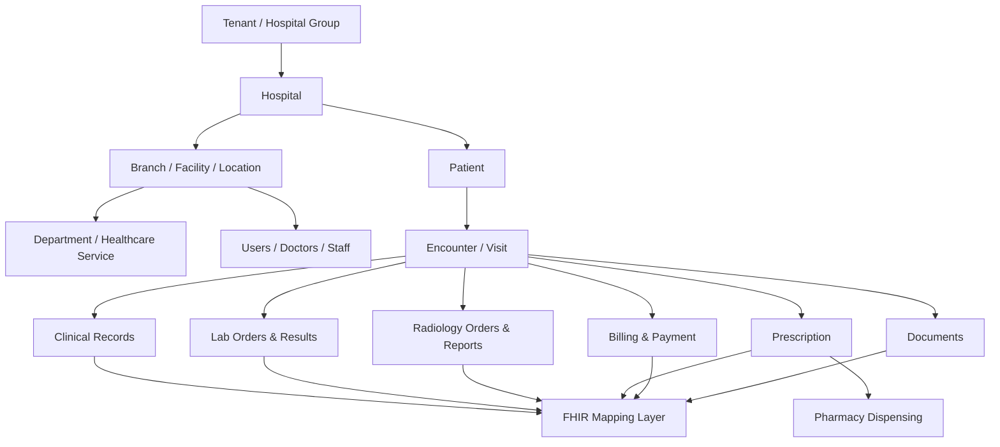
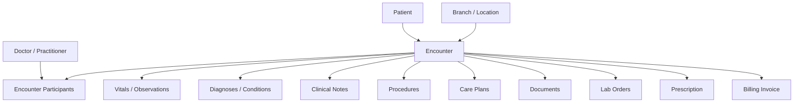
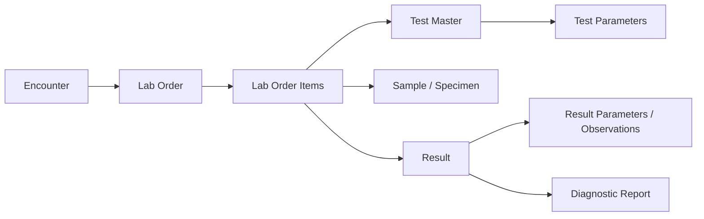
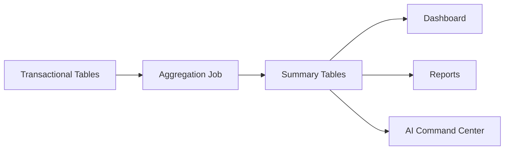
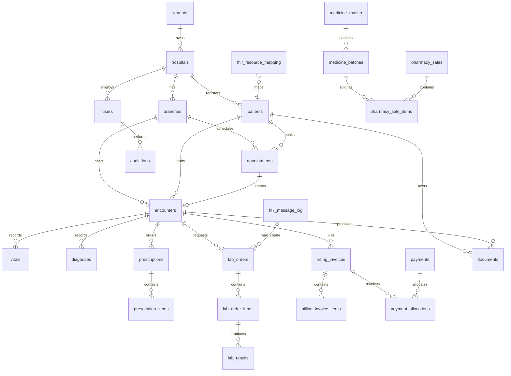

# Plasmit Hospital Management System - High-Level Database Contract, Table Relationship Blueprint & FHIR Mapping

## Executive Summary

This document is the database contract between database architect, backend developers, frontend developers, FHIR/HL7 integration developers, QA and project leadership. It defines what tables will exist, how they connect, which module owns them, and what rules every API and migration must follow.

## Contract Principles

- Every major table must include `tenant_id` and `hospital_id`.
- Every branch-level operational table must include `branch_id`.
- Patient is hospital-level by default.
- Encounter is branch-level and becomes the clinical anchor.
- No table can be created without owner and review.
- No backend query can fetch data without tenant/hospital/branch filters.
- Flyway migrations are mandatory.
- FHIR mapping must be documented for patient, clinical, lab, pharmacy, billing and documents.
- HL7 inbound/outbound messages must be logged.
- Reporting tables do not replace normalized transaction tables.

## Diagram Assets

- hierarchy: `docs/assets/database-contract/01_multitenant_hierarchy.png`
- foundation: `docs/assets/database-contract/02_foundation_relationship_contract.png`
- encounter: `docs/assets/database-contract/03_encounter_centric_clinical_contract.png`
- lab: `docs/assets/database-contract/04_lab_order_result_contract.png`
- pharmacy: `docs/assets/database-contract/05_pharmacy_inventory_contract.png`
- billing: `docs/assets/database-contract/06_billing_payment_insurance_contract.png`
- integration: `docs/assets/database-contract/07_fhir_hl7_integration_contract.png`
- reporting: `docs/assets/database-contract/08_reporting_contract.png`

## Multi-Tenant Hierarchy



## Foundation Relationships

| Parent Table | Child Table | Relationship | Join Key | Business Meaning | FHIR Mapping |
| --- | --- | --- | --- | --- | --- |
| tenants | hospitals | 1:N | hospitals.tenant_id | One tenant can own many hospitals. | Organization |
| hospitals | branches | 1:N | branches.hospital_id | One hospital can have many branches/facilities. | Location |
| hospitals | departments | 1:N | departments.hospital_id | Hospital defines departments. | HealthcareService |
| branches | departments | 1:N optional | departments.branch_id | Branch-specific departments when required. | HealthcareService |
| departments | healthcare_services | 1:N | healthcare_services.department_id | Department provides services. | HealthcareService |
| users | user_branch_access | 1:N | user_branch_access.user_id | User can access multiple authorized branches. | PractitionerRole |
| branches | user_branch_access | 1:N | user_branch_access.branch_id | Branch access is explicitly assigned. | Location |
| roles | role_permissions | 1:N | role_permissions.role_id | Role receives permissions. | N/A |
| permissions | role_permissions | 1:N | role_permissions.permission_id | Permission can be part of many roles. | N/A |

## Module-Wise Table List

| Module | Tables | FHIR Mapping |
| --- | --- | --- |
| Foundation | tenants, hospitals, branches, departments, healthcare_services, users, roles, permissions, role_permissions, user_branch_access | Organization, Location, HealthcareService, Practitioner, PractitionerRole |
| Patient | patients, patient_identifiers, patient_addresses, patient_contacts, patient_allergies, patient_insurance, patient_documents, patient_consent_records, patient_record_access_logs | Patient, RelatedPerson, AllergyIntolerance, DocumentReference, Consent, AuditEvent |
| Appointment | appointment_slots, appointments, appointment_status_history, appointment_reminders, appointment_cancellations | Appointment, Patient, Practitioner, Location, AuditEvent |
| Encounter / Clinical | encounters, encounter_participants, encounter_status_history, vitals, diagnoses, clinical_notes, clinical_documents, procedures, care_plans | Encounter, Observation, Condition, DocumentReference, Procedure, CarePlan |
| Prescription / Medication | prescriptions, prescription_items, medicine_master, medication_instructions, medication_administration_records, pharmacy_dispense, pharmacy_dispense_items | MedicationRequest, Medication, MedicationDispense, MedicationAdministration |
| Lab / Diagnostics | lab_test_master, lab_test_parameters, lab_orders, lab_order_items, lab_samples, lab_results, lab_result_parameters, diagnostic_reports, lab_result_review_history | ServiceRequest, Observation, DiagnosticReport, Specimen |
| Radiology | radiology_test_master, radiology_orders, radiology_order_items, radiology_reports, imaging_studies, radiology_report_review_history | ServiceRequest, DiagnosticReport, ImagingStudy, DocumentReference |
| Pharmacy / Inventory | medicine_categories, medicine_batches, pharmacy_stock, stock_movements, pharmacy_sales, pharmacy_sale_items, pharmacy_returns, pharmacy_return_items, purchase_orders, goods_receipts | Medication, MedicationDispense |
| Billing / Payment / Insurance | billing_invoices, billing_invoice_items, payments, payment_allocations, refunds, insurance_policies, insurance_claims, insurance_claim_items, claim_documents, claim_status_history | Account, ChargeItem, Claim, ExplanationOfBenefit, Coverage |
| IPD / Ward / Bed | admissions, wards, rooms, beds, bed_allocations, nursing_notes, nursing_tasks, discharge_plans, discharge_summaries | Encounter, Location, DocumentReference, Composition |
| Surgery / OT | operation_theatres, surgery_cases, surgery_team_members, surgery_checklists, anesthesia_records, surgery_notes, post_operation_notes | Procedure, Location, Observation, DocumentReference |
| Documents | documents, document_versions, document_access_logs, document_signatures | DocumentReference, Composition |
| Audit / Compliance | audit_logs, user_login_history, patient_record_access_logs, consent_records, break_glass_access_logs, data_export_logs | AuditEvent, Consent, Provenance |
| FHIR Integration | fhir_resource_mapping, fhir_resource_store, fhir_api_audit_log, fhir_sync_status, fhir_profile_registry, fhir_code_system_mapping, fhir_value_set_mapping | All mapped FHIR resources |
| HL7 Integration | hl7_message_log, hl7_message_error_log, hl7_external_identifier_mapping, hl7_patient_mapping, hl7_order_mapping, hl7_result_mapping | ADT, ORM, ORU, SIU, DFT, MDM message readiness |
| Reporting | daily_branch_revenue_summary, daily_patient_visit_summary, doctor_performance_summary, department_collection_summary, lab_test_volume_summary, pharmacy_stock_snapshot, bed_occupancy_summary, patient_journey_summary | N/A |

## Complete Table Relationship Matrix

| Module | Table Name | Primary Key | Foreign Keys | Connected Parent Table | Connected Child Table | Relationship Type | Tenant Scope | Branch Scope | FHIR Resource | Owner Team |
| --- | --- | --- | --- | --- | --- | --- | --- | --- | --- | --- |
| Foundation | tenants | id | None | None | hospitals | 1:N | Global/Tenant | No | Organization | Foundation Team |
| Foundation | hospitals | id | tenant_id | tenants | branches, departments, patients | 1:N | Tenant | No | Organization | Foundation Team |
| Foundation | branches | id | tenant_id, hospital_id | hospitals | appointments, encounters, pharmacy_stock | 1:N | Hospital | Yes | Location | Foundation Team |
| Foundation | users | id | tenant_id, hospital_id | hospitals | appointments, encounters, audit_logs | 1:N | Hospital | Optional | Practitioner | Foundation Team |
| Patient | patients | id | tenant_id, hospital_id | hospitals | encounters, appointments, documents | 1:N | Hospital | No by default | Patient | Patient Team |
| Patient | patient_identifiers | id | patient_id | patients | None | N:1 | Hospital | No | Patient.identifier | Patient Team |
| Appointment | appointments | id | patient_id, branch_id, doctor_id | patients, branches, users | encounters, reminders | N:1 / 1:N | Hospital | Yes | Appointment | Appointment Team |
| Encounter | encounters | id | patient_id, branch_id, appointment_id | patients, branches, appointments | vitals, diagnoses, lab_orders, prescriptions, invoices | 1:N | Hospital | Yes | Encounter | Clinical Team |
| Clinical | vitals | id | patient_id, encounter_id | patients, encounters | None | N:1 | Hospital | Yes | Observation | Clinical Team |
| Clinical | diagnoses | id | patient_id, encounter_id | patients, encounters | None | N:1 | Hospital | Yes | Condition | Clinical Team |
| Clinical | clinical_notes | id | patient_id, encounter_id, doctor_id | patients, encounters, users | documents | N:1 | Hospital | Yes | DocumentReference | Clinical Team |
| Prescription | prescriptions | id | patient_id, encounter_id, doctor_id | patients, encounters, users | prescription_items, pharmacy_dispense | 1:N | Hospital | Yes | MedicationRequest | Clinical Team |
| Prescription | prescription_items | id | prescription_id, medicine_id | prescriptions, medicine_master | pharmacy_dispense_items | N:1 | Hospital | Yes | MedicationRequest.dosage | Clinical/Pharmacy Team |
| Lab | lab_orders | id | patient_id, encounter_id, branch_id | patients, encounters, branches | lab_order_items | 1:N | Hospital | Yes | ServiceRequest | Lab Team |
| Lab | lab_order_items | id | lab_order_id, lab_test_id | lab_orders, lab_test_master | lab_samples, lab_results | 1:N | Hospital | Yes | ServiceRequest | Lab Team |
| Lab | lab_results | id | lab_order_item_id, patient_id, encounter_id | lab_order_items, patients, encounters | lab_result_parameters, diagnostic_reports | 1:N | Hospital | Yes | Observation | Lab Team |
| Radiology | radiology_orders | id | patient_id, encounter_id, branch_id | patients, encounters, branches | radiology_order_items | 1:N | Hospital | Yes | ServiceRequest | Radiology Team |
| Radiology | radiology_reports | id | radiology_order_item_id | radiology_order_items | imaging_studies, documents | 1:N | Hospital | Yes | DiagnosticReport | Radiology Team |
| Pharmacy | medicine_master | id | tenant_id, hospital_id | hospitals | medicine_batches | 1:N | Hospital | No | Medication | Pharmacy Team |
| Pharmacy | medicine_batches | id | medicine_id | medicine_master | pharmacy_stock, sale_items | 1:N | Hospital | Optional | Medication.batch | Pharmacy Team |
| Pharmacy | pharmacy_stock | id | branch_id, medicine_batch_id | branches, medicine_batches | stock_movements | 1:N | Hospital | Yes | Internal | Pharmacy Team |
| Pharmacy | pharmacy_sales | id | patient_id, branch_id, prescription_id | patients, branches, prescriptions | pharmacy_sale_items | 1:N | Hospital | Yes | MedicationDispense | Pharmacy Team |
| Billing | billing_invoices | id | patient_id, encounter_id, branch_id | patients, encounters, branches | invoice_items, payments, claims | 1:N | Hospital | Yes | Account | Billing Team |
| Billing | billing_invoice_items | id | invoice_id | billing_invoices | None | N:1 | Hospital | Yes | ChargeItem | Billing Team |
| Billing | payments | id | tenant_id, hospital_id, branch_id | billing_invoices via allocations | payment_allocations | N:M | Hospital | Yes | PaymentReconciliation | Billing Team |
| Insurance | insurance_claims | id | invoice_id, patient_id | billing_invoices, patients | claim_items, documents | 1:N | Hospital | Yes | Claim | Billing/Insurance Team |
| IPD | admissions | id | encounter_id, patient_id, branch_id | encounters, patients, branches | bed_allocations, nursing_notes, discharge_summaries | 1:N | Hospital | Yes | Encounter | IPD Team |
| IPD | beds | id | room_id, branch_id | rooms, branches | bed_allocations | 1:N | Hospital | Yes | Location | IPD Team |
| Surgery | surgery_cases | id | encounter_id, operation_theatre_id | encounters, operation_theatres | surgery_team_members, notes | 1:N | Hospital | Yes | Procedure | Surgery Team |
| Documents | documents | id | patient_id, encounter_id | patients, encounters | document_versions, access_logs | 1:N | Hospital | Optional | DocumentReference | Document Team |
| Audit | audit_logs | id | tenant_id, hospital_id, branch_id | users, all entities | None | N:1 | Tenant/Hospital | Optional | AuditEvent | Audit Team |
| FHIR | fhir_resource_mapping | id | internal_table_name, internal_record_id | All mapped tables | fhir_resource_store | 1:1 / 1:N | Tenant/Hospital | Optional | All resources | FHIR Team |
| HL7 | hl7_message_log | id | tenant_id, hospital_id, branch_id | External systems | hl7 mappings | 1:N | Tenant/Hospital | Optional | HL7 v2 | HL7 Team |
| Reporting | daily_branch_revenue_summary | id | tenant_id, hospital_id, branch_id | billing_invoices, payments | Dashboards | Generated | Hospital | Yes | N/A | Reporting Team |

## FHIR Mapping Matrix

| HMS Concept | Internal Tables | FHIR Resource | Integration Purpose | Owner |
| --- | --- | --- | --- | --- |
| Tenant / Hospital | tenants, hospitals | Organization | Represent organization, tenant group or hospital. | FHIR Team + Foundation |
| Branch / Facility | branches | Location | Represent facility, branch, ward, room or bed. | FHIR Team + Foundation |
| Department / Service | departments, healthcare_services | HealthcareService | Expose healthcare service catalog. | FHIR Team + Foundation |
| Doctor / Staff | users, practitioner_roles | Practitioner, PractitionerRole | Expose clinician and role context. | FHIR Team + Security |
| Patient | patients, patient_identifiers, patient_addresses, patient_contacts | Patient | Expose patient demographics and identifiers. | FHIR Team + Patient |
| Consent | patient_consent_records, consent_records | Consent | Consent tracking and data sharing permission. | FHIR Team + Compliance |
| Appointment | appointments | Appointment | Appointment scheduling and participants. | FHIR Team + Appointment |
| Encounter | encounters | Encounter | OPD, IPD, ER, day-care or virtual visit. | FHIR Team + Clinical |
| Vitals / Lab Values | vitals, lab_results, lab_result_parameters | Observation | Clinical measurements and lab values. | FHIR Team + Clinical/Lab |
| Diagnosis | diagnoses | Condition | Diagnosis/problem list. | FHIR Team + Clinical |
| Clinical Documents | clinical_notes, documents | DocumentReference, Composition | Clinical notes, summaries and signed documents. | FHIR Team + Documents |
| Procedure / Surgery | procedures, surgery_cases | Procedure | Procedure and surgery representation. | FHIR Team + Surgery |
| Care Plan | care_plans | CarePlan | Patient care planning. | FHIR Team + Clinical |
| Prescription | prescriptions, prescription_items | MedicationRequest | Medication orders. | FHIR Team + Clinical/Pharmacy |
| Medicine | medicine_master | Medication | Medicine catalog/reference. | FHIR Team + Pharmacy |
| Dispensing | pharmacy_dispense, pharmacy_sales | MedicationDispense | Dispensed medications. | FHIR Team + Pharmacy |
| Medication Admin | medication_administration_records | MedicationAdministration | Inpatient medicine administration. | FHIR Team + Nursing |
| Lab/Radiology Order | lab_orders, radiology_orders | ServiceRequest | Diagnostic, procedure and imaging orders. | FHIR Team + Lab/Radiology |
| Sample | lab_samples | Specimen | Lab specimen lifecycle. | FHIR Team + Lab |
| Diagnostic Report | diagnostic_reports, radiology_reports | DiagnosticReport | Lab/radiology report. | FHIR Team + Diagnostics |
| Imaging | imaging_studies | ImagingStudy | Imaging study references. | FHIR Team + Radiology |
| Billing Account | billing_invoices, patient_accounts | Account | Billing account context. | FHIR Team + Billing |
| Charges | billing_invoice_items | ChargeItem | Charge line items. | FHIR Team + Billing |
| Insurance | insurance_policies | Coverage | Insurance policy coverage. | FHIR Team + Billing |
| Claim | insurance_claims | Claim | Insurance claim submission. | FHIR Team + Billing |
| Payment Explanation | claim_status_history, payment_allocations | ExplanationOfBenefit | Claim/payment explanation when required. | FHIR Team + Billing |
| Audit | audit_logs | AuditEvent | Security and data access audit. | FHIR Team + Audit |

## Module Ownership Matrix

| Module | Owner Developer/Team | Tables Owned | Shared Tables Used | FHIR Resource Owner | Review Required From |
| --- | --- | --- | --- | --- | --- |
| Foundation | Foundation Team | tenants, hospitals, branches, departments, healthcare_services, users, roles, permissions | None | FHIR Team | Database Architect |
| Patient | Patient Team | patients, identifiers, addresses, contacts, allergies, documents, consent | hospitals, branches, users | FHIR Team | Database Architect + FHIR Team |
| Appointment | Appointment Team | appointment_slots, appointments, reminders, cancellations | patients, branches, users | FHIR Team | Patient + Foundation |
| Clinical / Encounter | Clinical Team | encounters, vitals, diagnoses, notes, procedures, care_plans | patients, branches, users | FHIR Team | Patient + FHIR Team |
| Lab / Radiology | Diagnostics Team | lab_orders, lab_results, diagnostic_reports, radiology_orders, imaging_studies | encounters, billing | FHIR/HL7 Team | Clinical + Billing + Integration |
| Pharmacy | Pharmacy Team | medicine_master, stock, sales, dispensing, returns | prescriptions, billing | FHIR Team | Clinical + Billing |
| Billing / Insurance | Billing Team | invoices, invoice_items, payments, refunds, policies, claims | patients, encounters, services | FHIR Team | Database Architect + Finance |
| IPD / Nursing | IPD Team | admissions, wards, rooms, beds, nursing_notes, discharge_summaries | patients, encounters, billing | FHIR Team | Clinical + Billing |
| Surgery / OT | Surgery Team | operation_theatres, surgery_cases, team, checklists, anesthesia, notes | encounters, billing | FHIR Team | Clinical + Architect |
| Documents | Document Team | documents, versions, access_logs, signatures | patients, encounters, users | FHIR Team | Clinical + Security |
| Audit / Compliance | Audit Team | audit_logs, login_history, access_logs, consent, break_glass, data_export | all modules | FHIR Team | Compliance + Security |
| FHIR Integration | FHIR Team | fhir_resource_mapping, store, audit, sync, profiles, code mapping | all mapped modules | FHIR Team | Architect + Module Owners |
| HL7 Integration | HL7 Team | hl7_message_log, errors, patient/order/result mappings | patient, lab, radiology, billing | Integration Team | Architect + Module Owners |
| Reporting | Reporting Team | summary and dashboard tables | all modules | N/A | Architect + Module Owners |

## Tenant Isolation Contract

| Table Type | Required Columns | Example Tables | Access Rule |
| --- | --- | --- | --- |
| Global table | id, code, name | country_master, fhir_resource_type_master | Readable by platform; no hospital isolation required. |
| Tenant-level table | tenant_id | subscription_plans, tenant_settings | Tenant admin and platform scope only. |
| Hospital-level table | tenant_id, hospital_id | patients, departments, doctors, medicine_master | Hospital cannot see another hospital's data. |
| Branch-level table | tenant_id, hospital_id, branch_id | appointments, encounters, lab_orders, billing_invoices, pharmacy_stock | Only allowed branch users can access. |
| Patient-level table | tenant_id, hospital_id, patient_id | patient_identifiers, patient_addresses, patient_contacts | Scoped to hospital patient. |
| Encounter-level table | tenant_id, hospital_id, branch_id, patient_id, encounter_id | vitals, diagnoses, prescriptions, lab_orders | Must match the encounter branch and patient. |

## Standard Query Contract

```sql
SELECT *
FROM patients
WHERE tenant_id = :tenantId
  AND hospital_id = :hospitalId
  AND is_deleted = 0;

SELECT *
FROM appointments
WHERE tenant_id = :tenantId
  AND hospital_id = :hospitalId
  AND branch_id IN (:allowedBranchIds)
  AND is_deleted = 0;
```

## Encounter Mermaid Diagram



## Lab Mermaid Diagram



## Reporting Mermaid Diagram



## High-Level ERD



## Developer Agreement Checklist

- Is this table already existing?
- Which module owns it?
- Is it global, tenant, hospital, branch, patient or encounter level?
- Does it need tenant_id/hospital_id/branch_id?
- Does it need patient_id or encounter_id?
- Does it map to FHIR?
- Does it need HL7 integration?
- Does it need audit log or reporting summary?
- Which other table connects with it?
- Which API will use it?
- Which index is required?

## Final Recommendation

Foundation tables are created first. Patient is the central hospital-level entity. Encounter is the central branch-level clinical entity. Lab, pharmacy, radiology, prescription and billing connect mostly through encounter. FHIR and HL7 are integration layers. Reporting tables are generated from normalized source tables. Tenant/hospital/branch isolation is mandatory.